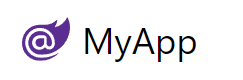

# Appearance & Branding

The logo at the top left can be changed by configuring the `UiFeature` plugin from your AppHost using `ConfigurePlugin<UiFeature>`.

```csharp
ConfigurePlugin<UiFeature>(feature => 
    feature.Info.BrandIcon = new ImageInfo { Uri = "/logo.svg", Cls = "w-8 h-8 mr-1" });
```

`Uri` is the path of your own logo from the `wwwroot` folder and the `Cls` value is the CSS classes applied to the image.

<ul class="my-8 grid gap-4 sm:grid-cols-2">
    <li class="rounded-lg m-0 col-span-1 flex flex-col text-center items-center bg-white shadow divide-y divide-gray-200">
        <div class="flex-1 flex flex-col px-4 mt-4">
            <div class="mt-4 p-0 text-xl font-medium text-gray-500">Default</div>
            <div class="rounded-lg focus-within:ring-2 focus-within:ring-offset-2 focus-within:ring-offset-gray-100 focus-within:ring-indigo-500 overflow-hidden">
                
            </div>
        </div>
    </li>
    <li class="rounded-lg m-0 col-span-1 flex flex-col text-center items-center bg-white shadow divide-y divide-gray-200">
        <div class="flex-1 flex flex-col px-4 mt-4">
            <div class="mt-4 p-0 text-xl font-medium text-gray-500">Custom branding</div>
            <div class="rounded-lg focus-within:ring-2 focus-within:ring-offset-2 focus-within:ring-offset-gray-100 focus-within:ring-indigo-500 overflow-hidden">
                
            </div>
        </div>
    </li>
</ul>

### Custom Brand Component

For even greater flexibility you can also replace the entire [Brand.html component](/docs/custom#custom-app-example) by
creating a local `Brand` component in 
[/wwwroot/modules/shared/Brand.html](https://github.com/NetCoreTemplates/blazor-wasm/blob/main/MyApp/wwwroot/modules/shared/Brand.html)
which the Blazor WASM template does with:

```html
<script>App.components({ Brand: '#brand-template' })</script>
<template id="brand-template">
<div class="flex items-center flex-shrink-0 max-w-sidebar">
    <a :title="serviceName" v-href="{ $page:'' }"
       class="text-2xl whitespace-nowrap overflow-x-hidden flex items-center">
       <svg xmlns="http://www.w3.org/2000/svg" class="w-8 h-8 ml-1 mr-2" viewBox="0 0 24 24">...</svg>
       {{serviceName}}
    </a>
</div>
</template>
```

To render its [custom App Brand component](https://blazor-wasm-api.jamstacks.net/ui):

[](https://blazor-wasm-api.jamstacks.net/ui)

## Custom Table Icons

Attributes added to your database model can change the visuals in your Locode application. For example, by adding `[Icon]`
top of `Booking` specifying either an `Svg` or `Uri` path we can change the icon for the table in left menu and table relationships.

```csharp
[Icon(Svg = "<svg xmlns=\"http://www.w3.org/2000/svg\" ...")]
public class Booking
{
    ...
}
```

Which will use this Icon whenever referring to `Booking` items:


### Custom Icons for Database-first tables

On database model classes, the `Icon` attribute can be used with a `Uri` or `Svg` to style the table in the left menu and when
lookup data is displayed. For example, if we use the `TypeFilter` to access the data model types, we can apply the `Icon` attribute dynamically
to `Order` it will impact the tables that reference `Order`.

```csharp
TypeFilter = (type, req) =>
{
    if (Icons.TryGetValue(type.Name, out var icon))
        type.AddAttribute(new IconAttribute { Svg = Svg.Create(icon) });
    ...
}

public static Dictionary<string, string> Icons { get; } = new()
{
    ["Order"] = "<path fill='currentColor' ...",
};
```


<ul class="my-8 grid gap-4 sm:grid-cols-2">
    <li class="rounded-lg m-0 col-span-1 flex flex-col text-center items-center bg-white shadow divide-y divide-gray-200">
        <div class="flex-1 flex flex-col px-4 mt-4">
            <div class="mt-4 p-0 text-xl font-medium text-gray-500">Default Icon</div>
            <div class="rounded-lg focus-within:ring-2 focus-within:ring-offset-2 focus-within:ring-offset-gray-100 focus-within:ring-indigo-500 overflow-hidden">
                
            </div>
        </div>
    </li>
    <li class="rounded-lg m-0 col-span-1 flex flex-col text-center items-center bg-white shadow divide-y divide-gray-200">
        <div class="flex-1 flex flex-col px-4 mt-4">
            <div class="mt-4 p-0 text-xl font-medium text-gray-500">Custom Icon</div>
            <div class="rounded-lg focus-within:ring-2 focus-within:ring-offset-2 focus-within:ring-offset-gray-100 focus-within:ring-indigo-500 overflow-hidden">
                
            </div>
        </div>
    </li>
</ul>

## Grouping services with Tag

To group the Northwind services under the same `Tag` name for the left menu in Locode, we can use the `Tag` attribute.

```csharp
[Tag("Northwind")]
public class Category { ... }

[Tag("Northwind")]
public class Customer { ... }
```

Instead of `Tables` we can now see our `Northwind` tag in the Locode app UI.

<ul class="my-8 grid gap-4 sm:grid-cols-2">
    <li class="rounded-lg m-0 col-span-1 flex flex-col text-center items-center bg-white shadow divide-y divide-gray-200">
        <div class="flex-1 flex flex-col px-4 mt-4">
            <div class="mt-4 p-0 text-xl font-medium text-gray-500">Default "Tables"</div>
            <div class="rounded-lg focus-within:ring-2 focus-within:ring-offset-2 focus-within:ring-offset-gray-100 focus-within:ring-indigo-500 overflow-hidden">
                
            </div>
        </div>
    </li>
    <li class="rounded-lg m-0 col-span-1 flex flex-col text-center items-center bg-white shadow divide-y divide-gray-200">
        <div class="flex-1 flex flex-col px-4 mt-4">
            <div class="mt-4 p-0 text-xl font-medium text-gray-500">Custom Tag</div>
            <div class="rounded-lg focus-within:ring-2 focus-within:ring-offset-2 focus-within:ring-offset-gray-100 focus-within:ring-indigo-500 overflow-hidden">
                
            </div>
        </div>
    </li>
</ul>

As more unique `Tag` names are added, additional drop down menus will be created to group your services together.

### Adding Tags to Database-first tables

We can add the `[Tag]` attribute to all our Database-First Request DTOs using [AutoQuery AutoGen's](https://docs.servicestack.net/autoquery-autogen) `ServiceFilter`: 

```cs
GenerateCrudServices = new GenerateCrudServices {
    AutoRegister = true,
    ServiceFilter = (op, req) => {
        // Annotate all Auto generated Request DTOs with [Tag("Northwind")] attribute
        op.Request.AddAttributeIfNotExists(new TagAttribute("Northwind"));
    },
}
```
