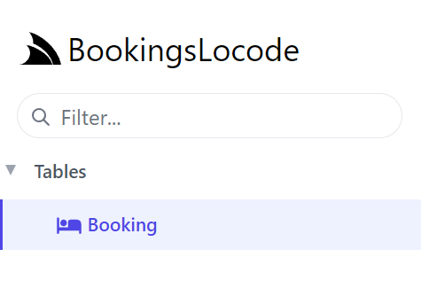

# Appearance & Branding

The logo at the top left can be changed by configuring the `UiFeature` plugin from your AppHost using `ConfigurePlugin<UiFeature>`.

```csharp
ConfigurePlugin<UiFeature>(feature => 
    feature.Info.BrandIcon = new ImageInfo { Uri = "/logo.svg", Cls = "w-8 h-8 mr-1" });
```

`Uri` is the path of your own logo from the `wwwroot` folder and the `Cls` value is the CSS classes applied to the same element.

<ul role="list" class="m-4 grid grid-cols-2 gap-x-4 gap-y-8 xl:gap-x-8">
  <li class="relative">
    <div class="group block w-full aspect-w-10 aspect-h-7 rounded-lg bg-gray-100 focus-within:ring-2 focus-within:ring-offset-2 focus-within:ring-offset-gray-100 focus-within:ring-indigo-500 overflow-hidden">
      
    </div>
    <p class="block text-sm font-medium text-gray-500 pointer-events-none">Default</p>
  </li>
  <li class="relative">
    <div class="group block w-full aspect-w-10 aspect-h-7 rounded-lg bg-gray-100 focus-within:ring-2 focus-within:ring-offset-2 focus-within:ring-offset-gray-100 focus-within:ring-indigo-500 overflow-hidden">
      
    </div>
    <p class="block text-sm font-medium text-gray-500 pointer-events-none">Custom branding</p>
  </li>
</ul>

### Custom Table Icons

Attributes added to your database model can change the visuals in your Locode application. For example, by adding `[Icon]`
top of `Booking` specifying either an `Svg` or `Uri` path we can change the icon for the table in left menu and table relationships.

```csharp
[Icon(Svg = "<svg xmlns=\"http://www.w3.org/2000/svg\" ...")]
public class Booking
{
    ...
}
```



### Grouping your services with `Tag`

To group the Northwind services under the same `Tag` name for the left menu in Locode, we can use the `Tag` attribute.

```csharp
GenerateCrudServices = new GenerateCrudServices {
    AutoRegister = true,
    ServiceFilter = (op, req) => {
        // Annotate all Auto generated Request DTOs with [Tag("Northwind")] attribute
        op.Request.AddAttributeIfNotExists(new TagAttribute("Northwind"));
    },
```

Instead of `Tables` we can now see our `Northwind` tag in the Locode app UI.

<ul role="list" class="m-4 grid grid-cols-2 gap-x-4 gap-y-8 xl:gap-x-8">
  <li class="relative">
    <div class="group block w-full aspect-w-10 aspect-h-7 rounded-lg bg-gray-100 focus-within:ring-2 focus-within:ring-offset-2 focus-within:ring-offset-gray-100 focus-within:ring-indigo-500 overflow-hidden">
      
    </div>
    <p class="block text-sm font-medium text-gray-500 pointer-events-none">Default "Tables"</p>
  </li>
  <li class="relative">
    <div class="group block w-full aspect-w-10 aspect-h-7 rounded-lg bg-gray-100 focus-within:ring-2 focus-within:ring-offset-2 focus-within:ring-offset-gray-100 focus-within:ring-indigo-500 overflow-hidden">
      
    </div>
    <p class="block text-sm font-medium text-gray-500 pointer-events-none">Custom Tag</p>
  </li>
</ul>

As more unique `Tag` names are added, additional drop down menus will be created to group your services together.

------------

### Branding

The logo at the top left can be changed by configuring the `UiFeature` plugin from your AppHost using `ConfigurePlugin<UiFeature>`.

```csharp
ConfigurePlugin<UiFeature>(feature => 
    feature.Info.BrandIcon = new ImageInfo { Uri = "/logo.svg", Cls = "w-8 h-8 mr-1" });
```

`Uri` is the path of your own logo from the `wwwroot` folder and the `Cls` value is the CSS classes applied to the same element.

<ul role="list" class="m-4 grid grid-cols-2 gap-x-4 gap-y-8 xl:gap-x-8">
  <li class="relative">
    <div class="group block w-full aspect-w-10 aspect-h-7 rounded-lg bg-gray-100 focus-within:ring-2 focus-within:ring-offset-2 focus-within:ring-offset-gray-100 focus-within:ring-indigo-500 overflow-hidden">
      
    </div>
    <p class="block text-sm font-medium text-gray-500 pointer-events-none">Default</p>
  </li>
  <li class="relative">
    <div class="group block w-full aspect-w-10 aspect-h-7 rounded-lg bg-gray-100 focus-within:ring-2 focus-within:ring-offset-2 focus-within:ring-offset-gray-100 focus-within:ring-indigo-500 overflow-hidden">
      
    </div>
    <p class="block text-sm font-medium text-gray-500 pointer-events-none">Custom branding</p>
  </li>
</ul>

### Custom table `Icon`

On database model classes, the `Icon` attribute can be used with a `Uri` or `Svg` to style the table in the left menu and when
lookup data is displayed. For example, if we use the `TypeFilter` to access the data model types, we can apply the `Icon` attribute dynamically
to `Order` it will impact the tables that reference `Order`.

```csharp
TypeFilter = (type, req) =>
{
    if (Icons.TryGetValue(type.Name, out var icon))
        type.AddAttribute(new IconAttribute { Svg = Svg.Create(icon) });
    ...
}

public static Dictionary<string, string> Icons { get; } = new()
{
    ["Order"] = "<path fill='currentColor' ...",
};
```

<ul role="list" class="m-4 grid grid-cols-1 xl:grid-cols-2 gap-x-4 gap-y-8 xl:gap-x-8">
  <li class="relative">
    <div class="group block w-full aspect-w-13 aspect-h-6 rounded-lg bg-gray-100 focus-within:ring-2 focus-within:ring-offset-2 focus-within:ring-offset-gray-100 focus-within:ring-indigo-500 overflow-hidden">
      
    </div>
    <p class="block text-sm font-medium text-gray-500 pointer-events-none">Default Icon</p>
  </li>
  <li class="relative">
    <div class="group block w-full aspect-w-13 aspect-h-6  rounded-lg bg-gray-100 focus-within:ring-2 focus-within:ring-offset-2 focus-within:ring-offset-gray-100 focus-within:ring-indigo-500 overflow-hidden">
      
    </div>
    <p class="block text-sm font-medium text-gray-500 pointer-events-none">Custom Icon</p>
  </li>
</ul>
