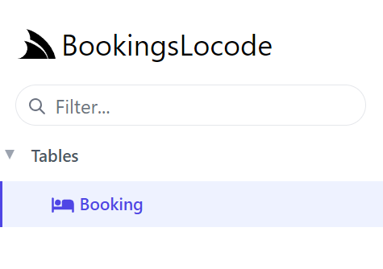

Code-first AutoQuery services which drive Locode include both the database model and the related request and response Data Transform Objects (DTOs).
These two classes can have additional attributes and AppHost configuration to extend the Locode App visuals and behavior.


## Bookings MVP

A simple example of using Locode for a back office bookings system would be a single table that a staff member populates.

### Create your project

To start off, we will create a project from the basic `web` template using the ServiceStack website. The link below will 
create a new project with the name "BookingsLocode".

<a href="https://account.servicestack.net/archive/NetCoreTemplates/web?Name=BookingsLocode" class="flex text-xl hover:no-underline">
    <div class="bg-white dark:bg-gray-800 px-4 py-4 mr-4 mb-4 rounded-lg shadow-lg text-center items-center justify-center hover:shadow-2xl dark:border-2 dark:border-pink-600 dark:hover:border-blue-600"
        style="">
      <div class="text-center font-extrabold flex items-center justify-center mb-2">
        <div class="text-4xl text-blue-600 my-3">
            <svg xmlns="http://www.w3.org/2000/svg" class="w-12 h-12" viewBox="0 0 24 24">
                <path fill="currentColor" d="M4 10.4V4a1 1 0 0 1 1-1h5V1h4v2h5a1 1 0 0 1 1 1v6.4l1.086.326a1 1 0 0 1 .682 1.2l-1.516 6.068A4.992 4.992 0 0 1 16 16a4.992 4.992 0 0 1-4 2a4.992 4.992 0 0 1-4-2a4.992 4.992 0 0 1-4.252 1.994l-1.516-6.068a1 1 0 0 1 .682-1.2L4 10.4zm2-.6L12 8l2.754.826l1.809.543L18 9.8V5H6v4.8zM4 20a5.978 5.978 0 0 0 4-1.528A5.978 5.978 0 0 0 12 20a5.978 5.978 0 0 0 4-1.528A5.978 5.978 0 0 0 20 20h2v2h-2a7.963 7.963 0 0 1-4-1.07A7.963 7.963 0 0 1 12 22a7.963 7.963 0 0 1-4-1.07A7.963 7.963 0 0 1 4 22H2v-2h2z"/>
            </svg>
        </div>
      </div>
      <span class="archive-name px-4 pb-2 text-blue-600 dark:text-indigo-400">BookingsLocode.zip</span>
      <div class="count mt-1 text-gray-400 text-sm"></div>
    </div>
</a>

The `web` template for a ServiceStack application will provide the basic solution structure
with a sample Hello World service. This can be done using the [ServiceStack website](https://servicestack.net) under
[Get Started](https://servicestack.net/start).

Alternatively, templates can be created using the dotnet CLI tool `x`. The dotnet `x` tool can be installed
using the following command:

:::sh
dotnet tool install --global x
:::

Once installed, a new `web` template can be created using:

:::sh
x new web MyProjectName
:::

### Mix in a database and AutoQuery

We can use the dotnet `x` tool to `mix` in specific database support and AutoQuery quickly using the command run from the project directory.

:::sh
x mix sqlite autoquery
:::

::: tip
Replace `sqlite` with `postgres`, `sqlserver`, or `mysql` or other RDBMS providers
:::

This command will create two files, `Configure.Db.cs` and `Configure.AutoQuery.cs` and install required NuGet dependencies into the AppHost (BookingsLocode in the link above) project.

### Bookings table

With our application setup to use SQLite and AutoQuery, we need to define our `Booking` table where our data will be stored.

```csharp
public class Booking
{
    [AutoIncrement]
    public int Id { get; set; }
    public string Name { get; set; }
    public RoomType RoomType { get; set; }
    public int RoomNumber { get; set; }
    public DateTime BookingStartDate { get; set; }
    public DateTime? BookingEndDate { get; set; }
    public decimal Cost { get; set; }
    public string Notes { get; set; }
    public bool? Cancelled { get; set; }
}

public enum RoomType
{
    Single,
    Double,
    Queen,
    Twin,
    Suite,
}
```

With our table schema defined in code, we can then use OrmLite to create the table for us if it doesn't already exist.
In the created `Configure.Db.cs` file where our SQLite connect is defined, we can replace the example commented out code 
to create the `Booking` table.


```csharp
public class ConfigureDb : IHostingStartup
{
    public void Configure(IWebHostBuilder builder) => builder
        .ConfigureServices((context, services) => {
            services.AddSingleton<IDbConnectionFactory>(new OrmLiteConnectionFactory(
                context.Configuration.GetConnectionString("DefaultConnection")
                ?? ":memory:",
                SqliteDialect.Provider));
        })
        // Create non-existing Table and add Seed Data Example
        .ConfigureAppHost(appHost => {
            using var db = appHost.Resolve<IDbConnectionFactory>().Open();
            if (db.CreateTableIfNotExists<Booking>())
            {
                // Seed data
                db.Insert(new Booking
                    {
                        Name = "Test",
                        Cost = 123,
                        RoomNumber = 321,
                        RoomType = RoomType.Queen,
                        Notes = "Testing more",
                        BookingStartDate = new DateTime(2022, 1, 1),
                        BookingEndDate = new DateTime(2022, 1, 5)
                    });
            }
        });
}
```

This initialized our database ready for use, but we still don't have any AutoQuery services defined.
AutoQuery needs to have the request and response DTOs to create AutoQuery services.

```csharp
public class QueryBookings : QueryDb<Booking>
{
    public int[] Ids { get; set; }
}

public class CreateBooking
    : ICreateDb<Booking>, IReturn<IdResponse>
{
    public string Name { get; set; }
    public RoomType RoomType { get; set; }
    public int RoomNumber { get; set; }
    public DateTime BookingStartDate { get; set; }
    public DateTime? BookingEndDate { get; set; }
    public decimal Cost { get; set; }
    public string Notes { get; set; }
}

public class UpdateBooking
    : IPatchDb<Booking>, IReturn<IdResponse>
{
    public int Id { get; set; }
    public string Name { get; set; }
    public RoomType? RoomType { get; set; }
    public int? RoomNumber { get; set; }
    public DateTime? BookingStartDate { get; set; }
    public DateTime? BookingEndDate { get; set; }
    public decimal? Cost { get; set; }
    public bool? Cancelled { get; set; }
    public string Notes { get; set; }
}

public class DeleteBooking : IDeleteDb<Booking>, IReturnVoid
{
    public int Id { get; set; }
}
```

Locode now has enough information to generate the Booking service forms.


Clicking on our `Booking` services on the left-hand menu utilizes the `QueryBooking` AutoQuery service, we can see the test seed data that was populated.


Using the `New Booking` button gives us a metadata driven form derived from the properties of the `CreateBooking` request DTO.


This form is also available for editing existing bookings using the Edit button in the first column. This functionality is enabled since the application has an `IPatch<Booking>` defined.


## Customizing Locode App

Locode has a number of attributes that can be used to add additional metadata to your services and data model.
This additional metadata in used by the Locode App to enhance the UI and provide additional functionality.

### Branding

The logo at the top left can be changed by configuring the `UiFeature` plugin from your AppHost using `ConfigurePlugin&lt;UiFeature&gt;`.

```csharp
ConfigurePlugin<UiFeature>(feature => 
    feature.Info.BrandIcon = new ImageInfo { Uri = "/logo.svg", Cls = "w-8 h-8 mr-1" });
```

`Uri` is the path of your own logo from the `wwwroot` folder and the `Cls` value is the CSS classes applied to the same element.

<ul role="list" class="m-4 grid grid-cols-2 gap-x-4 gap-y-8 xl:gap-x-8">
  <li class="relative">
    <div class="group block w-full aspect-w-10 aspect-h-7 rounded-lg bg-gray-100 focus-within:ring-2 focus-within:ring-offset-2 focus-within:ring-offset-gray-100 focus-within:ring-indigo-500 overflow-hidden">
      
    </div>
    <p class="block text-sm font-medium text-gray-500 pointer-events-none">Default</p>
  </li>
  <li class="relative">
    <div class="group block w-full aspect-w-10 aspect-h-7 rounded-lg bg-gray-100 focus-within:ring-2 focus-within:ring-offset-2 focus-within:ring-offset-gray-100 focus-within:ring-indigo-500 overflow-hidden">
      
    </div>
    <p class="block text-sm font-medium text-gray-500 pointer-events-none">Custom branding</p>
  </li>
</ul>

### Custom table icons

Attributes added to your database model can change the visuals in your Locode application. For example, by adding `[Icon]` 
top of `Booking` specifying either an `Svg` or `Uri` path we can change the icon for the table in left menu and table relationships.

```csharp
[Icon(Svg = "<svg xmlns=\"http://www.w3.org/2000/svg\" ...")]
public class Booking
{
    ...
}
```



## Relating tables

With a more complex database schema, Locode app can use join tables as lookups providing an easy UI to relate rows.

The [TalentBlazor]() demo which is a Locode application where back office recruitment staff can manage job applications.
It has 10 tables for all its functionality, but focusing on the main three of `Job`, `Contact` and `JobApplication` we can 
see how this functionality can save time.

```csharp
[Icon(Svg = Icons.Contact)]
public class Contact : AuditBase
{
    [AutoIncrement]
    public int Id { get; set; }
    public string DisplayName => FirstName + " " + LastName;
    public string ProfileUrl { get; set; }
    public string FirstName { get; set; }
    public string LastName { get; set; }
    public int? SalaryExpectation { get; set; }
    public string JobType { get; set; }
    public int AvailabilityWeeks { get; set; }
    public EmploymentType PreferredWorkType { get; set; }
    public string PreferredLocation { get; set; }
    public string Email { get; set; }
    public string Phone { get; set; }
    public string About { get; set; }
}
```

### Limiting to authenticated users

### Auditable services

A feature we can apply to the `Booking` example, is to add the ability to track operations on the API and keep basic audit information on the Booking table itself.
This can be done by inheriting from `AuditBase`, attributing each service request DTO with a relevant `AutoApply` behavior and registering the `OrmLiteCrudEvents` with 
the application IoC container.

```csharp
public class ConfigureAutoQuery : IHostingStartup
{
    public void Configure(IWebHostBuilder builder) => builder
        .ConfigureServices(services => {
            // Enable Audit History
            services.AddSingleton<ICrudEvents>(c =>
                new OrmLiteCrudEvents(c.Resolve<IDbConnectionFactory>()));
        })
        .ConfigureAppHost(appHost => {
            appHost.Plugins.Add(new AutoQueryFeature {
                MaxLimit = 1000,
                //IncludeTotal = true,
            });
            
            appHost.Resolve<ICrudEvents>().InitSchema();
        });
}
```

`ICrudEvents` stores events in a separate table, so the use of `InitSchema` above is required to make sure that table exists.

The `AuditBase` is used by the database models we want to be tracked.

```csharp
public class Booking : AuditBase
{
    [AutoIncrement]
    public int Id { get; set; }
    public string Name { get; set; }
    public RoomType RoomType { get; set; }
    public int RoomNumber { get; set; }
    public DateTime BookingStartDate { get; set; }
    public DateTime? BookingEndDate { get; set; }
    public decimal Cost { get; set; }
    public string Notes { get; set; }
    public bool? Cancelled { get; set; }
}
```

This will add the additional database constraint that `CreatedDate` and `CreatedBy` are not null, requiring adjustments to any seed data.

The [AutoApply](https://docs.servicestack.net/autoquery-crud#apply-generic-crud-behaviors) CRUD behaviors apply the additional data to the Booking table columns of
 `CreatedDate`,`CreatedBy`,`ModifiedDate`, etc.

```csharp
[AutoApply(Behavior.AuditQuery)]
public class QueryBookings : QueryDb<Booking>
{
    ...
}

[AutoApply(Behavior.AuditCreate)]
public class CreateBooking
    : ICreateDb<Booking>, IReturn<IdResponse>
{
    ...
}

[AutoApply(Behavior.AuditModify)]
public class UpdateBooking
    : IPatchDb<Booking>, IReturn<IdResponse>
{
    ...
}

[AutoApply(Behavior.AuditSoftDelete)]
public class DeleteBooking : IDeleteDb<Booking>, IReturnVoid
{
    ...
}
```

