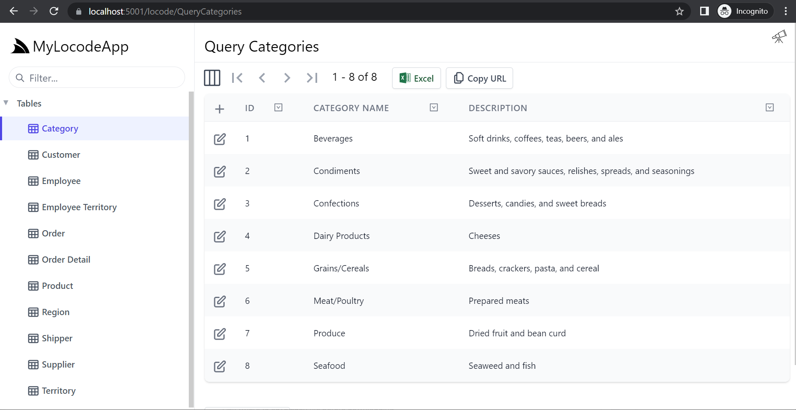

# Database-first
If you have an existing database with data that needs to be managed directly, a Create, Read, Update, Delete (CRUD) application,
you can configure your ServiceStack application to use AutoQuery Generated Services. This will use your database schema
to generate a working Locode app that can be extended and customized.


## Northwind example
We have an example of this in the [Northwind demo](https://northwind.locode.dev) which provides a way to manage 
all the data in the Northwind database with some customizations to improve usability, all with ~120 lines of C#.

## Create your project

<a href="https://account.servicestack.net/archive/NetCoreTemplates/web?Name=MyLocodeApp" class="flex text-xl hover:no-underline">
    <div class="bg-white dark:bg-gray-800 px-4 py-4 mr-4 mb-4 rounded-lg shadow-lg text-center items-center justify-center hover:shadow-2xl dark:border-2 dark:border-pink-600 dark:hover:border-blue-600"
        style="">
      <div class="text-center font-extrabold flex items-center justify-center mb-2">
        <div class="text-4xl text-blue-600 my-3">
            <svg xmlns="http://www.w3.org/2000/svg" class="w-12 h-12" viewBox="0 0 24 24">
                <path fill="currentColor" d="M4 10.4V4a1 1 0 0 1 1-1h5V1h4v2h5a1 1 0 0 1 1 1v6.4l1.086.326a1 1 0 0 1 .682 1.2l-1.516 6.068A4.992 4.992 0 0 1 16 16a4.992 4.992 0 0 1-4 2a4.992 4.992 0 0 1-4-2a4.992 4.992 0 0 1-4.252 1.994l-1.516-6.068a1 1 0 0 1 .682-1.2L4 10.4zm2-.6L12 8l2.754.826l1.809.543L18 9.8V5H6v4.8zM4 20a5.978 5.978 0 0 0 4-1.528A5.978 5.978 0 0 0 12 20a5.978 5.978 0 0 0 4-1.528A5.978 5.978 0 0 0 20 20h2v2h-2a7.963 7.963 0 0 1-4-1.07A7.963 7.963 0 0 1 12 22a7.963 7.963 0 0 1-4-1.07A7.963 7.963 0 0 1 4 22H2v-2h2z"/>
            </svg>
        </div>
      </div>
      <span class="archive-name px-4 pb-2 text-blue-600 dark:text-indigo-400">MyLocodeApp.zip</span>
      <div class="count mt-1 text-gray-400 text-sm"></div>
    </div>
</a>

Starting with the basic `web` template for a ServiceStack application will provide the basic solution structure 
with a sample Hello World service. This can be done using the [ServiceStack website](https://servicestack.net) under 
[Get Started](https://servicestack.net/start).

Alternatively, templates can be created using the dotnet CLI tool `x`. The dotnet `x` tool can be installed 
using the following command:

:::sh
dotnet tool install --global x
:::

Once installed, a new `web` template can be created using:

:::sh
x new web MyProjectName
:::

## Configuring database connection

Once you have the new web project open, you will need to configure the following.

- Database type (PostgreSQL, SQL Server, MySQL, or SQLite)
- Database connection string
- AutoQuery Generated Services

We can use the dotnet `x` tool to `mix` in specific database support and AutoQuery quickly using the command run from the project directory.

:::sh
x mix sqlite autoquery
:::

::: tip
Replace `sqlite` with `postgres`, `sqlserver`, or `mysql` or other RDBMS providers
:::

This command will create two files, `Configure.Db.cs` and `Configure.AutoQuery.cs` and install required NuGet dependencies into the AppHost (MyLocodeApp in the link above) project.


### Configure.Db.cs

Below we have an example using `sqlite` of the configuration to add an `IDbConnectionFactory` dependency into IoC created by this command.

```csharp
public class ConfigureDb : IHostingStartup
{
    public void Configure(IWebHostBuilder builder) => builder
        .ConfigureServices((context, services) => {
            services.AddSingleton<IDbConnectionFactory>(new OrmLiteConnectionFactory(
                context.Configuration.GetConnectionString("DefaultConnection")
                ?? ":memory:",
                SqliteDialect.Provider));
        });
}
```

The example above is using an in-`:memory:` SQLite database, but we want to use a pre-existing database the connection string will need to be updated.
To use the Northwind sample database, we can download and copy it into the AppHost project with the `Configure.Db.cs` file and replace the 
`:memory:` connection string with the file name `northwind.sqlite`. Another easy way to download `northwind.sqlite` is by using the `x` tool with the following 
command run from the AppHost directory.

:::sh
x mix northwind.sqlite
:::

Now our application can communicate with the Northwind sample database, we will need to configure AutoQuery to use AutoGen to generate our CRUD services from our database schema.

### Configure.AutoQuery.cs

With the database connection configured, next you will need to configure AutoQuery to scan your database schema and generate the required CRUD services.
This feature is known as `AutoGen` and can be enabled by instantiating the `GenerateCrudServices` option on the `AutoQueryFeature` plugin with the `AutoRegister` flag set to `true`.

```csharp
public class ConfigureAutoQuery : IHostingStartup
{
    public void Configure(IWebHostBuilder builder) => builder
        .ConfigureAppHost(appHost => {
            appHost.Plugins.Add(new AutoQueryFeature {
                MaxLimit = 1000,
                
                // Add this line, Configures Generated CRUD services with defaults
                GenerateCrudServices = new GenerateCrudServices()
                {
                    AutoRegister = true
                }
            });
        });
}
```

The `AutoQueryFeature` plugin will automatically use your registered `IDbConnectionFactory` to communicate with your database and generate services 
for the `public` schema. Running the application after these changes, we will have a `Query`, `Create`, `Update` and `Delete` services ready to use for each table.



### Multiple Schemas

By default, `GenerateCrudServices` with `AutoRegister` will create services for each table in the `public` schema.
If you want to enable services for tables in other schemas, you can use the `CreateServices` option. For example, if
you have a schema by the name of `dbo` and `public`, you would use the following options.

```csharp
appHost.Plugins.Add(new AutoQueryFeature {
    MaxLimit = 1000,
    //IncludeTotal = true,
    GenerateCrudServices = new GenerateCrudServices()
    {
        // Configure which schemas should be used, `public` is the default.
        CreateServices = new List<CreateCrudServices>
        {
            new CreateCrudServices(),
            new CreateCrudServices { Schema = "dbo" }
        }
    }
});
```

### Multiple database connections

If you are using [Named connections](https://docs.servicestack.net/autoquery-rdbms#named-connection) with [OrmLite](https://docs.servicestack.net/ormlite), you can also specify these connections in the `CreateServices` list.
Named connection registration can be done using the `IDbConnectionFactory` and `RegisterConnection` method.

```csharp
// SqlServer with a named "Reporting" PostgreSQL connection as a part of the same `dbFactory`
var dbFactory = new OrmLiteConnectionFactory(connString, SqlServer2012Dialect.Provider);
container.Register<IDbConnectionFactory>(dbFactory);

dbFactory.RegisterConnection("Reporting", pgConnString, PostgreSqlDialect.Provider);
```

The string name provided to `RegisterConnection` must match that provided to the `NamedConnection` property on `CreateCrudServices`.

```csharp
appHost.Plugins.Add(new AutoQueryFeature {
    MaxLimit = 1000,
    //IncludeTotal = true,
    GenerateCrudServices = new GenerateCrudServices()
    {
        // Configure multiple databases, `public` is the default schema.
        CreateServices = new List<CreateCrudServices>
        {
            new CreateCrudServices(),
            new CreateCrudServices { NamedConnection = "Reporting" }
        }
    }
});
```

### Multiple Schemas with Named Connections

These options can be combined so that specific schemas on named connections can also be used.

```csharp
appHost.Plugins.Add(new AutoQueryFeature {
    MaxLimit = 1000,
    //IncludeTotal = true,
    GenerateCrudServices = new GenerateCrudServices()
    {
        // Configure multiple databases, `public` is the default schema.
        CreateServices = new List<CreateCrudServices>
        {
            new CreateCrudServices { NamedConnection = "Reporting" },
            new CreateCrudServices { NamedConnection = "Finance", Schema = "trading" }
        }
    }
});
```

## Customizing Locode App

Locode has a number of attributes that can be used to add additional metadata to your services and data model.
This additional metadata in used by the Locode App to enhance the UI and provide additional functionality.

### Branding

The logo at the top left can be changed by configuring the `UiFeature` plugin from your AppHost using `ConfigurePlugin&lt;UiFeature&gt;`.

```csharp
ConfigurePlugin<UiFeature>(feature => 
    feature.Info.BrandIcon = new ImageInfo { Uri = "/logo.svg", Cls = "w-8 h-8 mr-1" });
```

`Uri` is the path of your own logo from the `wwwroot` folder and the `Cls` value is the CSS classes applied to the same element.

<ul role="list" class="m-4 grid grid-cols-2 gap-x-4 gap-y-8 xl:gap-x-8">
  <li class="relative">
    <div class="group block w-full aspect-w-10 aspect-h-7 rounded-lg bg-gray-100 focus-within:ring-2 focus-within:ring-offset-2 focus-within:ring-offset-gray-100 focus-within:ring-indigo-500 overflow-hidden">
      
    </div>
    <p class="block text-sm font-medium text-gray-500 pointer-events-none">Default</p>
  </li>
  <li class="relative">
    <div class="group block w-full aspect-w-10 aspect-h-7 rounded-lg bg-gray-100 focus-within:ring-2 focus-within:ring-offset-2 focus-within:ring-offset-gray-100 focus-within:ring-indigo-500 overflow-hidden">
      
    </div>
    <p class="block text-sm font-medium text-gray-500 pointer-events-none">Custom branding</p>
  </li>
</ul>

### Adding attributes at runtime

The use of C# attributes to configure your AutoQuery service metadata works well for declared classes but can also be applied dynamically at startup for generated services.
Locode uses a number of attributes on your data model type (related to each table in your database), and API request Data Transfer Object (DTO).

The `ServiceFilter` and `TypeFilter` properties on `GenerateCrudServices` are `Action`s you can override run at startup.
The `ServiceFilter` is called with every Service Operation when generating metadata for your services.
Here we can add attributes to the generated request DTOs using the `AddAttributes` or `AddAttributeIfNotExists` method.

### Grouping your services with `Tag`

To group the Northwind services under the same `Tag` name for the left menu in Locode, we can use the `Tag` attribute.

```csharp
GenerateCrudServices = new GenerateCrudServices {
    AutoRegister = true,
    ServiceFilter = (op, req) => {
        // Annotate all Auto generated Request DTOs with [Tag("Northwind")] attribute
        op.Request.AddAttributeIfNotExists(new TagAttribute("Northwind"));
    },
```

Instead of `Tables` we can now see our `Northwind` tag in the Locode app UI.

<ul role="list" class="m-4 grid grid-cols-2 gap-x-4 gap-y-8 xl:gap-x-8">
  <li class="relative">
    <div class="group block w-full aspect-w-10 aspect-h-7 rounded-lg bg-gray-100 focus-within:ring-2 focus-within:ring-offset-2 focus-within:ring-offset-gray-100 focus-within:ring-indigo-500 overflow-hidden">
      
    </div>
    <p class="block text-sm font-medium text-gray-500 pointer-events-none">Default "Tables"</p>
  </li>
  <li class="relative">
    <div class="group block w-full aspect-w-10 aspect-h-7 rounded-lg bg-gray-100 focus-within:ring-2 focus-within:ring-offset-2 focus-within:ring-offset-gray-100 focus-within:ring-indigo-500 overflow-hidden">
      
    </div>
    <p class="block text-sm font-medium text-gray-500 pointer-events-none">Custom Tag</p>
  </li>
</ul>

As more unique `Tag` names are added, additional drop down menus will be created to group your services together.

### Custom table `Icon`

On database model classes, the `Icon` attribute can be used with a `Uri` or `Svg` to style the table in the left menu and when 
lookup data is displayed. For example, if we use the `TypeFilter` to access the data model types, we can apply the `Icon` attribute dynamically
to `Order` it will impact the tables that reference `Order`.

```csharp
TypeFilter = (type, req) =>
{
    if (Icons.TryGetValue(type.Name, out var icon))
        type.AddAttribute(new IconAttribute { Svg = Svg.Create(icon) });
    ...
}

public static Dictionary<string, string> Icons { get; } = new()
{
    ["Order"] =
        "<path fill='currentColor' ...",
};
```

<ul role="list" class="m-4 grid grid-cols-1 xl:grid-cols-2 gap-x-4 gap-y-8 xl:gap-x-8">
  <li class="relative">
    <div class="group block w-full aspect-w-13 aspect-h-6 rounded-lg bg-gray-100 focus-within:ring-2 focus-within:ring-offset-2 focus-within:ring-offset-gray-100 focus-within:ring-indigo-500 overflow-hidden">
      
    </div>
    <p class="block text-sm font-medium text-gray-500 pointer-events-none">Default Icon</p>
  </li>
  <li class="relative">
    <div class="group block w-full aspect-w-13 aspect-h-6  rounded-lg bg-gray-100 focus-within:ring-2 focus-within:ring-offset-2 focus-within:ring-offset-gray-100 focus-within:ring-indigo-500 overflow-hidden">
      
    </div>
    <p class="block text-sm font-medium text-gray-500 pointer-events-none">Custom Icon</p>
  </li>
</ul>

### Managed Files Uploads

A high level feature that integrates with Locode is the `FileUploadFeature` plugin which is combined with `VirtualFileSource`.
This enables a way to associate a file path that can be stored in your custom tables which is mapped to a `VirtualFileSource`,
which means the uploaded files don't live in the database itself taking up a lot of room, the database only stores the reference.

```csharp
var wwwrootVfs = GetVirtualFileSource<FileSystemVirtualFiles>();
Plugins.Add(new FilesUploadFeature(
    new UploadLocation("employees", wwwrootVfs, allowExtensions: FileExt.WebImages,
        writeAccessRole: RoleNames.AllowAnon,
        resolvePath: ctx => $"/profiles/employees/{ctx.Dto.GetId()}.{ctx.FileExtension}")));
```

The `UploadLocation` is a named mapping which is then referenced on the data model column which stores the *path* only.
This reference is made using the `UploadTo` attribute specifying the matching name, eg "employees".

The `TypeFilter` also fires for request and response DTO types, and we can find matching request DTO types from the 
desired model name using `IsCrudCreateOrUpdate("Employee")`. This is a dynamic way of applying attributes to our 
database model `Employee` and related `CreateEmployee`/`UpdateEmployee` which can be more clearly represented in 
a code-first way using the following 3 classes. 

```csharp
// Generated database model
public class Employee
{
    ...
    [Format(FormatMethods.IconRounded)]
    public string PhotoPath { get;set; }
    ...
}

// Generated Request DTO for create
public class CreateEmployee : ICreateDb<Employee>, IReturn<IdResponse>
{
    ...
    [Input(Type=Input.Types.File)]
    [UploadTo("employees")]
    public string PhotoPath { get;set; }
}

// Generated Request DTO for create
public class UpdateEmployee : IPatchDb<Employee>, IReturn<IdResponse>
{
    ...
    [Input(Type=Input.Types.File)]
    [UploadTo("employees")]
    public string PhotoPath { get;set; }
}
```

This is done dynamically using the following code found in the `Northwind` Locode demo.

```csharp
```csharp
TypeFilter = (type, req) =>
{
    ...
    if (type.Name == "Employee" || type.IsCrudCreateOrUpdate("Employee"))
    {
        ...
        if (type.IsCrud())
        {
            type.Property("PhotoPath")
                .AddAttribute(new InputAttribute { Type = Input.Types.File })
                .AddAttribute(new UploadToAttribute("employees"));
        }
    }
    ...
}
```

Our sample Northwind database does store `Photo` as a blobbed data. For the demo, we are removing `Photo` column from 
the generated type and repurposing the `PhotoPath` to reference files matching the `Id` of the employee in a registered 
`FileSystemVirtualFiles` virtual file source.

::: tip
If files are stored in the database, to use the `FilesUploadFeature` they would need to be migrated out to a supported storage
:::

```csharp
TypeFilter = (type, req) =>
{
    ...
    if (type.Name == "Employee" || type.IsCrudCreateOrUpdate("Employee"))
    {
        type.Properties.RemoveAll(x => x.Name == "Photo");
        ...
    }
    ...
}
```

### Changing field `Input` controls

The `PhotoPath` and `Notes` properties on the `Epmployee` table also have custom `InputAttribute` applied to change the Locode app HTML input type.
Since the `PhotoPath` is related to a file upload and use of `UploadTo`, we want to have a way for the Locode client to upload files.
`[Input(Type=Input.Types.File)]` adds metadata so the Locode app knows to use a file upload control for this field. The `Notes` property 
contains more long form text, so instead of the standard one line `text` input, an `Input.Types.Textarea` can be used.

<ul role="list" class="m-4 grid grid-cols-1 xl:grid-cols-2 gap-x-4 gap-y-8 xl:gap-x-8">
  <li class="relative">
    <div class="group block w-full aspect-w-13 aspect-h-6 rounded-lg bg-gray-100 focus-within:ring-2 focus-within:ring-offset-2 focus-within:ring-offset-gray-100 focus-within:ring-indigo-500 overflow-hidden">
      
    </div>
    <p class="block text-sm font-medium text-gray-500 pointer-events-none">Without `Input`</p>
  </li>
  <li class="relative">
    <div class="group block w-full aspect-w-13 aspect-h-6  rounded-lg bg-gray-100 focus-within:ring-2 focus-within:ring-offset-2 focus-within:ring-offset-gray-100 focus-within:ring-indigo-500 overflow-hidden">
      
    </div>
    <p class="block text-sm font-medium text-gray-500 pointer-events-none">Custom `Input`</p>
  </li>
</ul>

### Lookup tables and appearance

With the database-first approach, foreign ke columns and table relationships are reflected in the Locode app with the use of 
look up tables when created, editing or navigating between services. In the Northwind example, this can be seen in services like 
`OrderDetails`, `Order` and `Product`. If the database doesn't have this relationship in the schema but you need 
to add it in Locode app, the `Ref` attribute can be ued. 

```
TypeFilter = (type, req) =>
{
    ...
    if (type.Name == "Employee" || type.IsCrudCreateOrUpdate("Employee"))
    {
        ...
        if (type.IsCrud())
        {
            ...
        }
        else if (type.Name == "Employee")
        {
            type.Property("ReportsTo").AddAttribute(
                new RefAttribute { Model = "Employee", RefId = "Id", RefLabel = "LastName" });
        }
    }
}
```

<ul role="list" class="m-4 grid grid-cols-1 xl:grid-cols-2 gap-x-4 gap-y-8 xl:gap-x-8">
  <li class="relative">
    <div class="group block w-full aspect-w-13 aspect-h-6 rounded-lg bg-gray-100 focus-within:ring-2 focus-within:ring-offset-2 focus-within:ring-offset-gray-100 focus-within:ring-indigo-500 overflow-hidden">
      
    </div>
    <p class="block text-sm font-medium text-gray-500 pointer-events-none">Without `Input`</p>
  </li>
  <li class="relative">
    <div class="group block w-full aspect-w-13 aspect-h-6  rounded-lg bg-gray-100 focus-within:ring-2 focus-within:ring-offset-2 focus-within:ring-offset-gray-100 focus-within:ring-indigo-500 overflow-hidden">
      
    </div>
    <p class="block text-sm font-medium text-gray-500 pointer-events-none">Custom `Input`</p>
  </li>
</ul>

This enables the lookup field UI functionality for the `ReportsTo` property making it is easy to select the correct `Id` to be stored in the same column.


The use of `RefLabel` controls which column on the `RefModel` is to be used as the visual data in the Locode app. The `RefId` is the target `RefModel` column in the foreign key relationship.

### Format column data and client methods

To make the Locode app UI easier to use, data can be reformatted on the client for query results. For example, `Phone` and 
`Fax` properties for `Customer`, `Supplier`, and `Shipper` can use the `FormatAttribute` and the `FormatMethods.LinkPhone` option 
to change the UI to present these columns as a `tel:` HTML link. 

```csharp
TypeFilter = (type, req) =>
{
    ...
    if (type.Name == "Employee" || type.IsCrudCreateOrUpdate("Employee"))
    {
        ...
    }
    ...
    else if (type.Name is "Customer" or "Supplier" or "Shipper")
    {
        type.Property("Phone").AddAttribute(new FormatAttribute(FormatMethods.LinkPhone));
        type.Property("Fax")?.AddAttribute(new FormatAttribute(FormatMethods.LinkPhone));
    }
}
```

<ul role="list" class="m-4 grid grid-cols-2 gap-x-4 gap-y-8 xl:gap-x-8">
  <li class="relative">
    <div class="group block rounded-lg bg-gray-100 focus-within:ring-2 focus-within:ring-offset-2 focus-within:ring-offset-gray-100 focus-within:ring-indigo-500 overflow-hidden">
      
    </div>
    <p class="block text-sm font-medium text-gray-500 pointer-events-none">Default text</p>
  </li>
  <li class="relative">
    <div class="group block rounded-lg bg-gray-100 focus-within:ring-2 focus-within:ring-offset-2 focus-within:ring-offset-gray-100 focus-within:ring-indigo-500 overflow-hidden">
      
    </div>
    <p class="block text-sm font-medium text-gray-500 pointer-events-none">FormatMethods.LinkPhone</p>
  </li>
</ul>

The `FormatMethods` reference JavaScript methods registered on the client by default.

```csharp
  public static class FormatMethods
  {
    public const string Currency = "currency";
    public const string Bytes = "bytes";
    public const string Icon = "icon";
    public const string IconRounded = "iconRounded";
    public const string Attachment = "attachment";
    public const string Link = "link";
    public const string LinkEmail = "linkMailTo";
    public const string LinkPhone = "linkTel";
    public const string Hidden = "hidden";
  }
```

Another example of `FormatMethods` used in Northwind is `FormatMethods.IconRounded` combined with the file upload `PhotoPath`.

```csharp
TypeFilter = (type, req) =>
{
    ...
    if (type.Name == "Employee" || type.IsCrudCreateOrUpdate("Employee"))
    {
        ...
        type.ReorderProperty("PhotoPath", before: "Title")
            .AddAttribute(new FormatAttribute(FormatMethods.IconRounded));
        ...
    }
}
```

`ReorderProperty` is used to change ordering of the properties which impacts the Locode app default column orderings.
Once the `FormatAttribute` applies the `IconRounded` we get a preview of our file right in the Locode app.

<ul role="list" class="m-4 grid grid-cols-2 gap-x-4 gap-y-8 xl:gap-x-8">
  <li class="relative">
    <div class="group block rounded-lg focus-within:ring-2 focus-within:ring-offset-2 focus-within:ring-offset-gray-100 focus-within:ring-indigo-500 overflow-hidden">
      
    </div>
    <p class="block text-sm font-medium text-gray-500 pointer-events-none">Default text</p>
  </li>
  <li class="relative">
    <div class="group block rounded-lg focus-within:ring-2 focus-within:ring-offset-2 focus-within:ring-offset-gray-100 focus-within:ring-indigo-500 overflow-hidden">
      
    </div>
    <p class="block text-sm font-medium text-gray-500 pointer-events-none">FormatMethods.IconRounded</p>
  </li>
</ul>

::: tip
Images are not original Northwind, paths were migrated to match configured File `FilesUploadFeature` and the following SQL statement.

```sql
update Employee set PhotoPath = "/profiles/employees/" || Employee.Id || ".jpg"
```
:::

Other client formatting can be found on attributes like `IntlNumber`,`IntlDateTime` and `IntlRelativeTime`. OrderDetail 
uses `IntlNumber` with `Currency = NumberCurrency.USD` for UnitPrice and `IntlNumber(NumberStyle.Percent)` for Discount.

```csharp
TypeFilter = (type, req) =>
{
    ...
    if (type.Name == "Employee" || type.IsCrudCreateOrUpdate("Employee"))
    {
        ...
    }
    ...
    else if (type.Name == "OrderDetail")
    {
        type.Property("UnitPrice").AddAttribute(new IntlNumber { Currency = NumberCurrency.USD });
        type.Property("Discount").AddAttribute(new IntlNumber(NumberStyle.Percent));
    }
    ...
}
```

Giving a much more contextual view of the data in the returning from our services.

<ul role="list" class="m-4 grid grid-cols-2 gap-x-4 gap-y-8 xl:gap-x-8">
  <li class="relative">
    <div class="group block rounded-lg focus-within:ring-2 focus-within:ring-offset-2 focus-within:ring-offset-gray-100 focus-within:ring-indigo-500 overflow-hidden">
      
    </div>
    <p class="block text-sm font-medium text-gray-500 pointer-events-none">Default text</p>
  </li>
  <li class="relative">
    <div class="group block rounded-lg focus-within:ring-2 focus-within:ring-offset-2 focus-within:ring-offset-gray-100 focus-within:ring-indigo-500 overflow-hidden">
      
    </div>
    <p class="block text-sm font-medium text-gray-500 pointer-events-none">IntlNumber used</p>
  </li>
</ul>