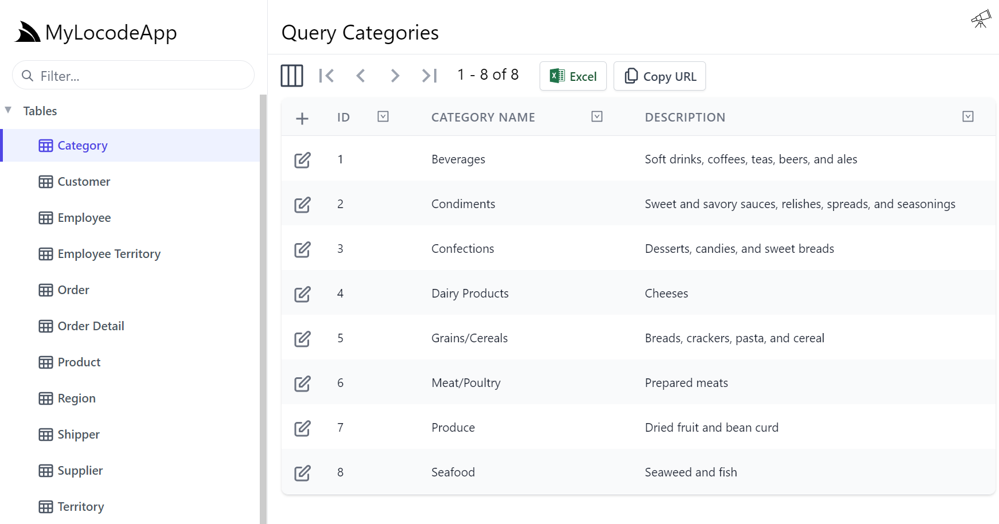

# Database-first
If you have an existing database with data that needs to be managed directly, a Create, Read, Update, Delete (CRUD) application,
you can configure your ServiceStack application to use AutoQuery Generated Services. This will use your database schema
to generate a working Locode app that can be extended and customized.


## Northwind example
We have an example of this in the [Northwind demo](https://northwind.locode.dev) which provides a way to manage 
all the data in the Northwind database with some customizations to improve usability, all with ~120 lines of C#.

## Create your project

<a href="https://account.servicestack.net/archive/NetCoreTemplates/web?Name=MyLocodeApp" class="flex text-xl hover:no-underline">
    <div class="bg-white dark:bg-gray-800 px-4 py-4 mr-4 mb-4 rounded-lg shadow-lg text-center items-center justify-center hover:shadow-2xl dark:border-2 dark:border-pink-600 dark:hover:border-blue-600"
        style="">
      <div class="text-center font-extrabold flex items-center justify-center mb-2">
        <div class="text-4xl text-blue-600 my-3">
            <svg xmlns="http://www.w3.org/2000/svg" class="w-12 h-12" viewBox="0 0 24 24">
                <path fill="currentColor" d="M4 10.4V4a1 1 0 0 1 1-1h5V1h4v2h5a1 1 0 0 1 1 1v6.4l1.086.326a1 1 0 0 1 .682 1.2l-1.516 6.068A4.992 4.992 0 0 1 16 16a4.992 4.992 0 0 1-4 2a4.992 4.992 0 0 1-4-2a4.992 4.992 0 0 1-4.252 1.994l-1.516-6.068a1 1 0 0 1 .682-1.2L4 10.4zm2-.6L12 8l2.754.826l1.809.543L18 9.8V5H6v4.8zM4 20a5.978 5.978 0 0 0 4-1.528A5.978 5.978 0 0 0 12 20a5.978 5.978 0 0 0 4-1.528A5.978 5.978 0 0 0 20 20h2v2h-2a7.963 7.963 0 0 1-4-1.07A7.963 7.963 0 0 1 12 22a7.963 7.963 0 0 1-4-1.07A7.963 7.963 0 0 1 4 22H2v-2h2z"/>
            </svg>
        </div>
      </div>
      <span class="archive-name px-4 pb-2 text-blue-600 dark:text-indigo-400">MyLocodeApp.zip</span>
      <div class="count mt-1 text-gray-400 text-sm"></div>
    </div>
</a>

Starting with the basic `web` template for a ServiceStack application will provide the basic solution structure 
with a sample Hello World service. This can be done using the [ServiceStack website](https://servicestack.net) under 
[Get Started](https://servicestack.net/start).

Alternatively, templates can be created using the dotnet CLI tool `x`. The dotnet `x` tool can be installed 
using the following command:

:::sh
dotnet tool install --global x
:::

Once installed, a new `web` template can be created using:

:::sh
x new web MyProjectName
:::

## Configuring database connection

Once you have the new web project open, you will need to configure the following.

- Database type (PostgreSQL, SQL Server, MySQL, or SQLite)
- Database connection string
- AutoQuery Generated Services

We can use the dotnet `x` tool to `mix` in specific database support and AutoQuery quickly using the command run from the project directory.

:::sh
x mix sqlite autoquery
:::

::: tip
Replace `sqlite` with `postgres`, `sqlserver`, or `mysql` or other RDBMS providers
:::

This command will create two files, `Configure.Db.cs` and `Configure.AutoQuery.cs` and install required NuGet dependencies into the AppHost (MyLocodeApp in the link above) project.


### Configure.Db.cs

Below we have an example using `sqlite` of the configuration to add an `IDbConnectionFactory` dependency into IoC created by this command.

```csharp
public class ConfigureDb : IHostingStartup
{
    public void Configure(IWebHostBuilder builder) => builder
        .ConfigureServices((context, services) => {
            services.AddSingleton<IDbConnectionFactory>(new OrmLiteConnectionFactory(
                context.Configuration.GetConnectionString("DefaultConnection")
                ?? ":memory:",
                SqliteDialect.Provider));
        });
}
```

The example above is using an in-`:memory:` SQLite database, but we want to use a pre-existing database the connection string will need to be updated.
To use the Northwind sample database, we can download and copy it into the AppHost project with the `Configure.Db.cs` file and replace the 
`:memory:` connection string with the file name `northwind.sqlite`. Another easy way to download `northwind.sqlite` is by using the `x` tool with the following 
command run from the AppHost directory.

:::sh
x mix northwind.sqlite
:::

Now our application can communicate with the Northwind sample database, we will need to configure AutoQuery to use AutoGen to generate our CRUD services from our database schema.

### Configure.AutoQuery.cs

With the database connection configured, next you will need to configure AutoQuery to scan your database schema and generate the required CRUD services.
This feature is known as `AutoGen` and can be enabled by instantiating the `GenerateCrudServices` option on the `AutoQueryFeature` plugin with the `AutoRegister` flag set to `true`.

```csharp
public class ConfigureAutoQuery : IHostingStartup
{
    public void Configure(IWebHostBuilder builder) => builder
        .ConfigureAppHost(appHost => {
            appHost.Plugins.Add(new AutoQueryFeature {
                MaxLimit = 1000,
                
                // Add this line, Configures Generated CRUD services with defaults
                GenerateCrudServices = new GenerateCrudServices()
                {
                    AutoRegister = true
                }
            });
        });
}
```

The `AutoQueryFeature` plugin will automatically use your registered `IDbConnectionFactory` to communicate with your database and generate services 
for the `public` schema. Running the application after these changes, we will have a `Query`, `Create`, `Update` and `Delete` services ready to use for each table.



### Multiple Schemas

By default, `GenerateCrudServices` with `AutoRegister` will create services for each table in the `public` schema.
If you want to enable services for tables in other schemas, you can use the `CreateServices` option. For example, if
you have a schema by the name of `dbo` and `public`, you would use the following options.

```csharp
appHost.Plugins.Add(new AutoQueryFeature {
    MaxLimit = 1000,
    //IncludeTotal = true,
    GenerateCrudServices = new GenerateCrudServices()
    {
        // Configure which schemas should be used, `public` is the default.
        CreateServices = new List<CreateCrudServices>
        {
            new CreateCrudServices(),
            new CreateCrudServices { Schema = "dbo" }
        }
    }
});
```

### Multiple database connections

If you are using [Named connections](https://docs.servicestack.net/autoquery-rdbms#named-connection) with [OrmLite](https://docs.servicestack.net/ormlite), you can also specify these connections in the `CreateServices` list.
Named connection registration can be done using the `IDbConnectionFactory` and `RegisterConnection` method.

```csharp
// SqlServer with a named "Reporting" PostgreSQL connection as a part of the same `dbFactory`
var dbFactory = new OrmLiteConnectionFactory(connString, SqlServer2012Dialect.Provider);
container.Register<IDbConnectionFactory>(dbFactory);

dbFactory.RegisterConnection("Reporting", pgConnString, PostgreSqlDialect.Provider);
```

The string name provided to `RegisterConnection` must match that provided to the `NamedConnection` property on `CreateCrudServices`.

```csharp
appHost.Plugins.Add(new AutoQueryFeature {
    MaxLimit = 1000,
    //IncludeTotal = true,
    GenerateCrudServices = new GenerateCrudServices()
    {
        // Configure multiple databases, `public` is the default schema.
        CreateServices = new List<CreateCrudServices>
        {
            new CreateCrudServices(),
            new CreateCrudServices { NamedConnection = "Reporting" }
        }
    }
});
```

### Multiple Schemas with Named Connections

These options can be combined so that specific schemas on named connections can also be used.

```csharp
appHost.Plugins.Add(new AutoQueryFeature {
    MaxLimit = 1000,
    //IncludeTotal = true,
    GenerateCrudServices = new GenerateCrudServices()
    {
        // Configure multiple databases, `public` is the default schema.
        CreateServices = new List<CreateCrudServices>
        {
            new CreateCrudServices { NamedConnection = "Reporting" },
            new CreateCrudServices { NamedConnection = "Finance", Schema = "trading" }
        }
    }
});
```

## Customizing Locode App

Locode has a number of attributes that can be used to add additional metadata to your services and data model.
This additional metadata in used by the Locode App to enhance the UI and provide additional functionality.


### Adding attributes at runtime

The use of C# attributes to configure your AutoQuery service metadata works well for declared classes but can also be applied dynamically at startup for generated services.
Locode uses a number of attributes on your data model type (related to each table in your database), and API request Data Transfer Object (DTO).

The `ServiceFilter` and `TypeFilter` properties on `GenerateCrudServices` are `Action`s you can override run at startup.
The `ServiceFilter` is called with every Service Operation when generating metadata for your services.
Here we can add attributes to the generated Request DTOs using the `AddAttributes` or `AddAttributeIfNotExists` method.


### Format column data and client methods

To make the Locode app UI easier to use, data can be reformatted on the client for query results. For example, `Phone` and 
`Fax` properties for `Customer`, `Supplier`, and `Shipper` can use the `FormatAttribute` and the `FormatMethods.LinkPhone` option 
to change the UI to present these columns as a `tel:` HTML link. 

```csharp
TypeFilter = (type, req) =>
{
    ...
    if (type.Name == "Employee" || type.IsCrudCreateOrUpdate("Employee"))
    {
        ...
    }
    ...
    else if (type.Name is "Customer" or "Supplier" or "Shipper")
    {
        type.Property("Phone").AddAttribute(new FormatAttribute(FormatMethods.LinkPhone));
        type.Property("Fax")?.AddAttribute(new FormatAttribute(FormatMethods.LinkPhone));
    }
}
```

<ul class="my-8 grid gap-4 sm:grid-cols-2">
    <li class="rounded-lg m-0 col-span-1 flex flex-col text-center items-center bg-white shadow divide-y divide-gray-200">
        <div class="flex-1 flex flex-col px-4 mt-4">
            <div class="mt-4 p-0 text-xl font-medium text-gray-500">Default</div>
            <div class="rounded-lg focus-within:ring-2 focus-within:ring-offset-2 focus-within:ring-offset-gray-100 focus-within:ring-indigo-500 overflow-hidden">
                
            </div>
        </div>
    </li>
    <li class="rounded-lg m-0 col-span-1 flex flex-col text-center items-center bg-white shadow divide-y divide-gray-200">
        <div class="flex-1 flex flex-col px-4 mt-4">
            <div class="mt-4 p-0 text-xl font-medium text-gray-500">FormatMethods.LinkPhone</div>
            <div class="rounded-lg focus-within:ring-2 focus-within:ring-offset-2 focus-within:ring-offset-gray-100 focus-within:ring-indigo-500 overflow-hidden">
                
            </div>
        </div>
    </li>
</ul>

The `FormatMethods` reference JavaScript methods registered on the client by default.

```csharp
public static class FormatMethods
{
    public const string Currency = "currency";
    public const string Bytes = "bytes";
    public const string Icon = "icon";
    public const string IconRounded = "iconRounded";
    public const string Attachment = "attachment";
    public const string Link = "link";
    public const string LinkEmail = "linkMailTo";
    public const string LinkPhone = "linkTel";
    public const string Hidden = "hidden";
}
```

Another example of `FormatMethods` used in Northwind is `FormatMethods.IconRounded` combined with the file upload `PhotoPath`.

```csharp
TypeFilter = (type, req) =>
{
    ...
    if (type.Name == "Employee" || type.IsCrudCreateOrUpdate("Employee"))
    {
        ...
        type.ReorderProperty("PhotoPath", before: "Title")
            .AddAttribute(new FormatAttribute(FormatMethods.IconRounded));
        ...
    }
}
```

`ReorderProperty` is used to change ordering of the properties which impacts the Locode app default column orderings.
Once the `FormatAttribute` applies the `IconRounded` we get a preview of our file right in the Locode app.

<ul class="grid gap-4 sm:grid-cols-2">
    <li class="rounded-lg m-0 col-span-1 flex flex-col text-center items-center bg-white shadow divide-y divide-gray-200">
        <div class="flex-1 flex flex-col px-4 mt-4">
            <div class="mt-4 p-0 text-xl font-medium text-gray-500">Default</div>
            <div class="rounded-lg focus-within:ring-2 focus-within:ring-offset-2 focus-within:ring-offset-gray-100 focus-within:ring-indigo-500 overflow-hidden">
                
            </div>
        </div>
    </li>
    <li class="rounded-lg m-0 col-span-1 flex flex-col text-center items-center bg-white shadow divide-y divide-gray-200">
        <div class="flex-1 flex flex-col px-4 mt-4">
            <div class="mt-4 p-0 text-xl font-medium text-gray-500">FormatMethods.IconRounded</div>
            <div class="rounded-lg focus-within:ring-2 focus-within:ring-offset-2 focus-within:ring-offset-gray-100 focus-within:ring-indigo-500 overflow-hidden">
                
            </div>
        </div>
    </li>
</ul>

::: tip
Images are not original Northwind, paths were migrated to match configured File `FilesUploadFeature` and the following SQL statement.

```sql
update Employee set PhotoPath = "/profiles/employees/" || Employee.Id || ".jpg"
```
:::

Other client formatting can be found on attributes like `IntlNumber`,`IntlDateTime` and `IntlRelativeTime`. OrderDetail 
uses `IntlNumber` with `Currency = NumberCurrency.USD` for UnitPrice and `IntlNumber(NumberStyle.Percent)` for Discount.

```csharp
TypeFilter = (type, req) =>
{
    ...
    if (type.Name == "Employee" || type.IsCrudCreateOrUpdate("Employee"))
    {
        ...
    }
    ...
    else if (type.Name == "OrderDetail")
    {
        type.Property("UnitPrice").AddAttribute(new IntlNumber { Currency = NumberCurrency.USD });
        type.Property("Discount").AddAttribute(new IntlNumber(NumberStyle.Percent));
    }
    ...
}
```

The `[Intl*]` attributes provide a typed API to utilize JavaScript's rich 
[Intl](https://developer.mozilla.org/en-US/docs/Web/JavaScript/Reference/Global_Objects/Intl) object containing the
namespace for the ECMAScript Internationalization API, which provides number formatting, and date & time formatting.

This can give a much more contextual view of the data in the returning from our services.

<ul class="grid gap-4 sm:grid-cols-2">
    <li class="rounded-lg m-0 col-span-1 flex flex-col text-center items-center bg-white shadow divide-y divide-gray-200">
        <div class="flex-1 flex flex-col px-4 mt-4">
            <div class="mt-4 p-0 text-xl font-medium text-gray-500">Default</div>
            <div class="rounded-lg focus-within:ring-2 focus-within:ring-offset-2 focus-within:ring-offset-gray-100 focus-within:ring-indigo-500 overflow-hidden">
                
            </div>
        </div>
    </li>
    <li class="rounded-lg m-0 col-span-1 flex flex-col text-center items-center bg-white shadow divide-y divide-gray-200">
        <div class="flex-1 flex flex-col px-4 mt-4">
            <div class="mt-4 p-0 text-xl font-medium text-gray-500">IntlNumber</div>
            <div class="rounded-lg focus-within:ring-2 focus-within:ring-offset-2 focus-within:ring-offset-gray-100 focus-within:ring-indigo-500 overflow-hidden">
                
            </div>
        </div>
    </li>
</ul>
