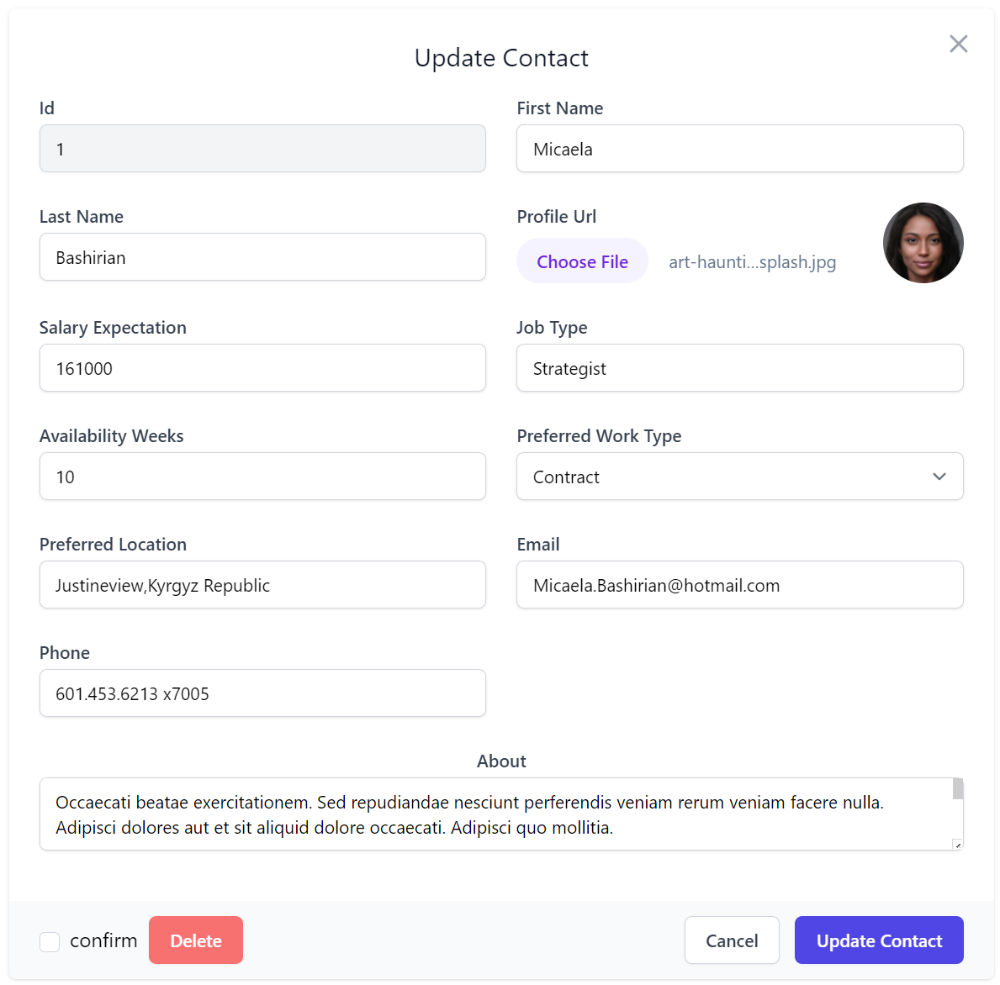
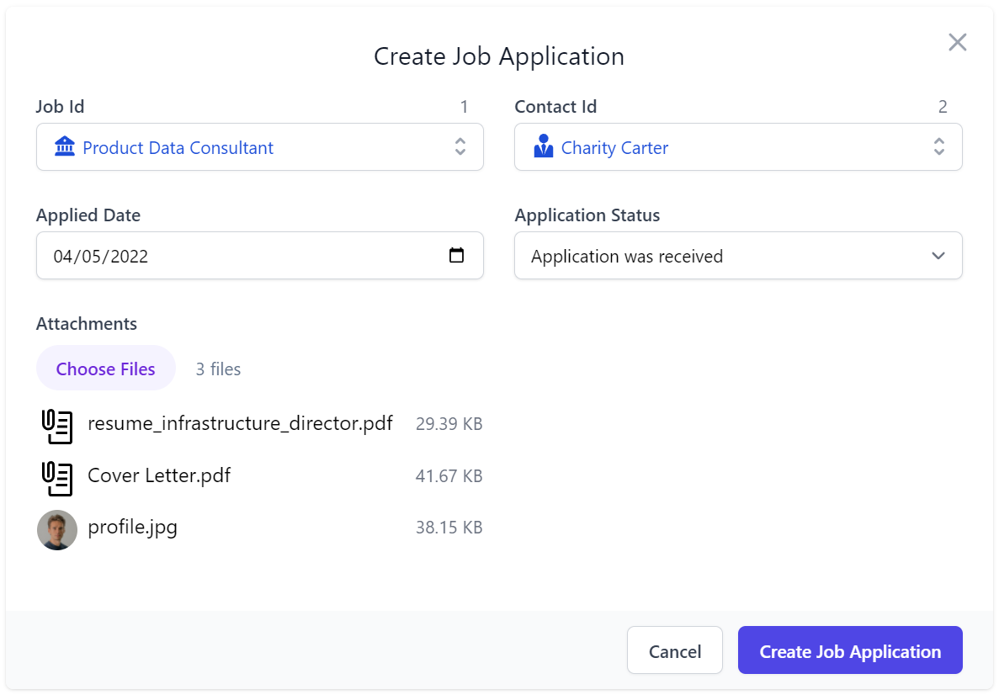
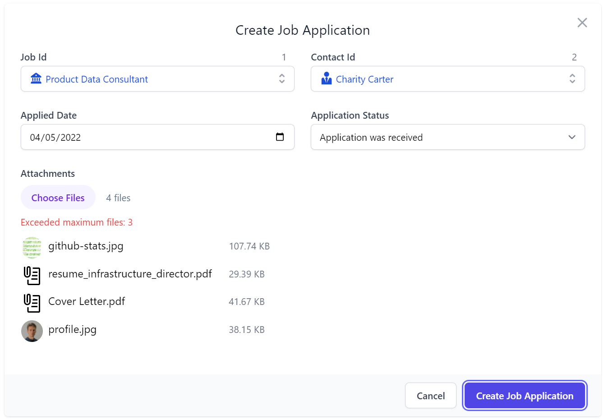
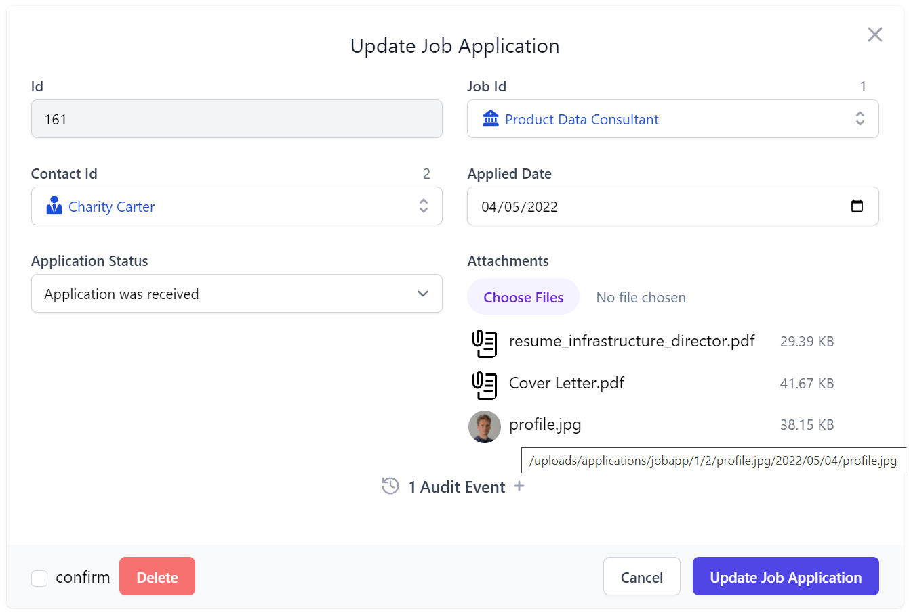
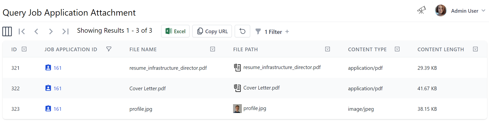

# Managed Files Uploads

The `FileUploadFeature` plugin is a high-level ServiceStack feature that allows you to configure multiple managed
file upload locations within the same App that you can declaratively bind to different APIs to use. 

Upload Locations can be configured to use any of the supported 
[Writable Virtual File Systems](https://docs.servicestack.net/virtual-file-system#writable-virtual-file-system) including:

- `FileSystemVirtualFiles` - Hard-disk or Network Files and Directories from a specified directory
- `S3VirtualFiles` - Files stored on Amazon's S3 Managed File Storage in [ServiceStack.Aws](https://github.com/ServiceStack/ServiceStack.Aws#s3virtualfiles)
- `AzureBlobVirtualFiles` - Files stored on Azure's Managed Blob Storage in [ServiceStack.Azure](https://github.com/ServiceStack/ServiceStack.Azure)
- `GistVirtualFiles` - Files persisted to a GitHub Gist
- `MemoryVirtualFiles` - Temporary Virtual Files and Folders that last for the lifetime of the AppHost

With additional support can be added by [Implementing a new Virtual File System](https://docs.servicestack.net/virtual-file-system#implementing-a-new-virtual-file-system).

This is a generic feature that can be used by any ServiceStack HTTP API, which as it can be declaratively annotated on
Request DTOs is especially useful in [AutoQuery CRUD APIs](https://docs.servicestack.net/autoquery-crud) as it enables
an easy way to populate a file path that can be stored along with your table row without the uploaded files living in the 
database itself taking up a lot of RDBMS resources and significantly impacting its performance.

### Basic File Upload Example

To demonstrate how to use the Managed File Uploads feature we'll look at handling the basic example of uploading files
to publicly accessible `/wwwroot` folder location. This is what the [talent.locode.dev](https://talent.locode.dev) Demo
uses to handle profile image uploads for Contacts and Users in different locations in its 
[Configure.AppHost.cs](https://github.com/NetCoreApps/TalentBlazor/blob/main/TalentBlazor/Configure.AppHost.cs):

```csharp
var wwwrootVfs = GetVirtualFileSource<FileSystemVirtualFiles>();
Plugins.Add(new FilesUploadFeature(
    new UploadLocation("profiles", wwwrootVfs, allowExtensions:FileExt.WebImages,
        resolvePath: ctx => $"/profiles/{ctx.FileName}"),

    new UploadLocation("users", wwwrootVfs, allowExtensions:FileExt.WebImages,
        resolvePath: ctx => $"/profiles/users/{ctx.UserAuthId}.{ctx.FileExtension}"));
```

As both locations are uploaded to the App's `/wwwroot` folder they'll be immediately accessible after they're uploaded.
Contact profile images are saved using their uploaded FileName whilst User profiles are saved in a predictable location
against their User Id and uploaded File Extension type.

The only default restriction placed on File Uploads is that they can only be performed by Authenticated Users. 
Each `UploadLocation` is able to use the several configuration options available to further restrict file uploads
by file type, count, size, number of uploads or a custom validation function. In this instance Talent Blazor
is restricting uploads in `allowExtensions` to only Images supported by Browsers.

To simplify configuration 
[we've included](https://github.com/ServiceStack/ServiceStack/blob/main/ServiceStack/src/ServiceStack/FilesUploadFeature.cs) 
a number of pre-configured file extensions for different file types.

```csharp
public static class FileExt
{
    string[] WebImages = { "png", "jpg", "jpeg", "gif", "svg", "webp" };
    string[] BinaryImages = {"png", "jpg", "jpeg", "gif", "bmp", "tif", "tiff", "webp", "ai", "psd","ps"};
    string[] Images = WebImages.CombineDistinct(BinaryImages);
    string[] WebVideos = { "avi", "m4v", "mov", "mp4", "mpg", "mpeg", "wmv", "webm" };
    string[] WebAudios = { "mp3", "mpa", "ogg", "wav", "wma", "mid", "webm" };
    string[] BinaryDocuments = { "doc", "docx", "pdf", "rtf" };
    string[] TextDocuments = { "tex", "txt", "md", "rst" };
    string[] Spreadsheets = { "xls", "xlsm", "xlsx", "ods", "csv", "txv" };
    string[] Presentations = { "key", "odp", "pps", "ppt", "pptx" };
    string[] AllDocuments = BinaryDocuments.CombineDistinct(TextDocuments, Presentations, Spreadsheets);
    string[] WebFormats = WebImages.CombineDistinct(WebVideos, WebAudios);
}
```

### Using File Upload Locations in APIs

With just the above configuration we can now use them in our APIs, which Talent Blazor does in its `CreateContact`
and `UpdateContact` [CRUD APIs](https://docs.servicestack.net/autoquery-crud) to handle uploading a contact profiles image 
when they're Created and Updated:

```csharp
public class CreateContact : ICreateDb<Contact>, IReturn<Contact>
{
    [ValidateNotEmpty]
    public string FirstName { get; set; } = string.Empty;
    [ValidateNotEmpty]
    public string LastName { get; set; } = string.Empty;
    
    [Input(Type = "file"), UploadTo("profiles")]
    public string? ProfileUrl { get; set; }

    public int? SalaryExpectation { get; set; }
    [ValidateNotEmpty]
    public string JobType { get; set; } = string.Empty;
    public int AvailabilityWeeks { get; set; }
    public EmploymentType PreferredWorkType { get; set; }
    [ValidateNotEmpty]
    public string PreferredLocation { get; set; } = string.Empty;
    [ValidateNotEmpty]
    public string Email { get; set; } = string.Empty;
    public string? Phone { get; set; }
}

public class UpdateContact : IPatchDb<Contact>, IReturn<Contact>
{
    public int Id { get; set; }
    [ValidateNotEmpty]
    public string? FirstName { get; set; }
    [ValidateNotEmpty]
    public string? LastName { get; set; }

    [Input(Type = "file"), UploadTo("profiles")]
    public string? ProfileUrl { get; set; }
    
    public int? SalaryExpectation { get; set; }
    [ValidateNotEmpty]
    public string? JobType { get; set; }
    public int? AvailabilityWeeks { get; set; }
    public EmploymentType? PreferredWorkType { get; set; }
    public string? PreferredLocation { get; set; }
    [ValidateNotEmpty]
    public string? Email { get; set; }
    public string? Phone { get; set; }
    [Input(Type = "textarea"), FieldCss(Field = "col-span-12 text-center")]
    public string? About { get; set; }
}
```

Only the `[UploadTo(location)]` attribute is required to instruct the API to use the specified Upload Location to 
handle the File Upload. For successful uploads the Uploaded HTTP File will be saved to the configured file path which
it populates on the `ProfileUrl` property which from that point is treated as a normal `string` property that is 
validated and stored along with the rest of the DTO properties in the `Contact` Table.

### Auto Form UIs

In API Explorer & Locode Apps you'll want to pair this together with `[Input(Type="file")]` to instruct the Auto Form UI
to use its File Upload control to handle updating this property, which looks like:

[](https://talent.locode.dev/locode/QueryContacts?edit=1)

### Managed Multi File Upload example

In addition to managing image profiles for its Users and Contacts, Talent Blazor also uses Managed File Uploads to
handle accepting an Applicant's Job Application attachments. We need a more 
[advanced configuration](https://github.com/NetCoreApps/FileBlazor/blob/main/FileBlazor/Configure.AppHost.cs) 
to handle this use-case where we want to:

 - Save uploaded Applications to non-servable **~/App_Data** folder
 - Limit Job Applications to a maximum of **3 attachments**
 - Limit Max Upload size to **10mb**
 - Allow **non-authenticated Users** to upload & download their attachments

```csharp
var appDataVfs = new FileSystemVirtualFiles(ContentRootDirectory.RealPath.CombineWith("App_Data"));
Plugins.Add(new FilesUploadFeature(
    //...
    new UploadLocation("applications", appDataVfs, maxFileCount: 3, maxFileBytes: 10_000_000,
        resolvePath: ctx => ctx.GetLocationPath((ctx.Dto is CreateJobApplication create
            ? $"jobapp/{create.JobId}/{create.ContactId}/{ctx.FileName}"
            : $"app/{ctx.Dto.GetId()}") + $"/{ctx.DateSegment}/{ctx.FileName}"),
        readAccessRole: RoleNames.AllowAnon, writeAccessRole: RoleNames.AllowAnon)
));
```

In this case instead of resolving a relative path from `/wwwroot` it uses `ctx.GetLocationPath()` to resolve to a managed 
file location whose access is managed by  `FilesUploadFeature` File Management APIs:

| API                 | Route                               | Description                                       |
|---------------------|-------------------------------------|---------------------------------------------------|
| `StoreFileUpload`   | **POST** `/uploads/{Name}`          | Upload files to the specified managed location    |
| `GetFileUpload`     | **GET** `/uploads/{Name}/{Path}`    | Download file from the specified managed location |
| `ReplaceFileUpload` | **PUT** `/uploads/{Name}/{Path}`    | Overwrite file at the specified managed location  |
| `DeleteFileUpload`  | **DELETE** `/uploads/{Name}/{Path}` | Delete file at the specified managed location     |

:::tip
`/uploads` is the overridable default `BasePath` for `FilesUploadFeature` managed File APIs
:::

With everything configured we can now start accepting attachments with our Job Applications by adding 
`[Input(Type="file"), UploadTo("applications")]` to the property where we want the Uploaded File metadata populated to
when submitting and updating Job Applications:

```csharp
public class CreateJobApplication : ICreateDb<JobApplication>, IReturn<JobApplication>
{
    [ValidateGreaterThan(0)]
    public int JobId { get; set; }
    [ValidateGreaterThan(0)]
    public int ContactId { get; set; }
    public DateTime AppliedDate { get; set; }
    public JobApplicationStatus ApplicationStatus { get; set; }
    [Input(Type="file"), UploadTo("applications")]
    public List<JobApplicationAttachment> Attachments { get; set; }
}

public class UpdateJobApplication : IPatchDb<JobApplication>, IReturn<JobApplication>
{
    public int Id { get; set; }
    public int? JobId { get; set; }
    public int? ContactId { get; set; }
    public DateTime? AppliedDate { get; set; }
    public JobApplicationStatus ApplicationStatus { get; set; }
    [Input(Type="file"), UploadTo("applications")]
    public List<JobApplicationAttachment>? Attachments { get; set; }
}
```

This is all that's needed to configure our Create CRUD Services to handle multiple file uploads in Locode & API Explorer:



Where the File Input behaves as just another Input control with contextual validation errors displayed when it exceeds
any of the configured file restrictions on its Upload Location, e.g:



After a successful submission the attachments are uploaded to the configured managed location path which is then used to 
access the file in the Update Job Application Form UI:



### Integrates with AutoQuery CRUD

This is another example of how well this generic feature works with the rest of ServiceStack, where without any 
implementation logic the AutoQuery CRUD API is able to populate a **1 to Many** table relationship to capture the metadata 
of each uploaded file because the `Attachments` Request DTO property maps to a `[Reference]` 
[POCO Reference](https://docs.servicestack.net/ormlite/reference-support) property which automatically populates 
Foreign Key Reference properties in CRUD APIs.

```csharp
public class JobApplication : AuditBase
{
    [Reference]
    public List<JobApplicationAttachment> Attachments { get; set; }
    //...
}

public class JobApplicationAttachment
{
    [AutoIncrement]
    public int Id { get; set; }

    [References(typeof(JobApplication))]
    public int JobApplicationId { get; set; }

    public string FileName { get; set; }
    [Format(FormatMethods.Attachment)]
    public string FilePath { get; set; }
    public string ContentType { get; set; }
    [Format(FormatMethods.Bytes)]
    public long ContentLength { get; set; }
}
```

### Uploaded File Metadata populated in Complex Type properties

This also shows that `[UploadTo]` can either be applied to a `string` property where it's just populated with the
path the file is uploaded to, or it could contain a **complex type** where any matching properties are populated with
metadata of the uploaded file:

| Property      | Description                                             |
|---------------|---------------------------------------------------------|
| FilePath      | The UploadLocation path where the file is uploaded to   |
| Name          | The form field name from the Content-Disposition header |
| FileName      | The file name of the uploaded file                      |
| ContentLength | The size in bytes of the uploaded file                  |
| ContentType   | The Content-Type of the uploaded file                   |

In addition, it also supports `List<string>` or `List<T>` complex types for handling multiple file uploads as in this case.

All these features work together to achieve our desired result of populating submitted applications in the 
`JobApplicationAttachment` joined table, so their metadata can be browsed, queried and navigated like any other
related data without file system access and without their contents consuming RDBMS resources:



## Substitutable Virtual File Providers

We've created the [File Blazor Demo](https://file.locode.dev) to further demonstrate the versatility of the 
`FilesUploadFeature` to seamlessly manage uploading files to multiple different locations using different
providers but still able to utilize the same custom configuration and validation in its
[Configure.AppHost.cs](https://github.com/NetCoreApps/FileBlazor/blob/main/FileBlazor/Configure.AppHost.cs):

```csharp
var appFs = new FileSystemVirtualFiles(ContentRootDirectory.RealPath.CombineWith("App_Data").AssertDir());
var s3Client = new AmazonS3Client(awsAccessKeyId, awsSecretAccessKey, RegionEndpoint.USEast1);
var s3DataVfs = new S3VirtualFiles(s3Client, "file-blazor-demo");
var azureBlobVfs = new AzureBlobVirtualFiles(azureBlobConnString, "file-blazor-demo");

Plugins.Add(new FilesUploadFeature(
    new UploadLocation("azure", azureBlobVfs,
        readAccessRole: RoleNames.AllowAnon, resolvePath: ResolveUploadPath,
        validateUpload: ValidateUpload, validateDownload: ValidateDownload),
    new UploadLocation("s3", s3DataVfs,
        readAccessRole: RoleNames.AllowAnon, resolvePath: ResolveUploadPath,
        validateUpload: ValidateUpload, validateDownload: ValidateDownload),
    new UploadLocation("fs", appFs,
        readAccessRole: RoleNames.AllowAnon, resolvePath: ResolveUploadPath,
        validateUpload: ValidateUpload, validateDownload: ValidateDownload)
));

static string ResolveUploadPath(FilesUploadContext ctx) =>
    ctx.Dto is IAppFile { FileAccessType: { } } createFile
        ? createFile.FileAccessType != FileAccessType.Private
            ? ctx.GetLocationPath($"/{createFile.FileAccessType}/{ctx.FileName}")
            : ctx.GetLocationPath($"/{createFile.FileAccessType}/{ctx.UserAuthId}/{ctx.FileName}")
        : throw HttpError.BadRequest("Invalid file creation request.");

static void ValidateUpload(IRequest request, IHttpFile file)
{
    if (request.Dto is IAppFile createFile)
    {
        var accessType = createFile.FileAccessType;
        var ext = file.FileName.LastRightPart('.');
        if (accessType == FileAccessType.Gallery && ext != null && FileExt.Images.Contains(ext) == false)
            throw new ArgumentException("Supported file extensions: {0}".LocalizeFmt(request, 
                string.Join(", ", FileExt.Images.Map(x => '.' + x).OrderBy(x => x))), file.FileName);
    }
    else
        throw new HttpError("Invalid request.");
}
//...
```


https://github.com/ServiceStack/ServiceStack/blob/main/ServiceStack/tests/NorthwindAuto/Configure.AppHost.cs

```csharp
var uploadVfs = new FileSystemVirtualFiles(TalentBlazorWwwRootDir);
var appDataVfs = new FileSystemVirtualFiles(TalentBlazorAppDataDir);

Plugins.Add(new FilesUploadFeature(
    new UploadLocation("profiles", uploadVfs, allowExtensions:FileExt.WebImages,
        resolvePath:ctx => $"/profiles/{ctx.FileName}"),
    
    new UploadLocation("game_items", appDataVfs, allowExtensions:FileExt.WebImages),
    
    new UploadLocation("files", GetVirtualFileSource<FileSystemVirtualFiles>(),
        resolvePath:ctx => $"/files/{ctx.FileName}"),
    
    new UploadLocation("users", uploadVfs, allowExtensions:FileExt.WebImages,
        resolvePath:ctx => $"/profiles/users/{ctx.UserAuthId}.{ctx.FileExtension}"),

    new UploadLocation("applications", appDataVfs, maxFileCount: 3, maxFileBytes: 10_000_000,
        resolvePath: ctx => ctx.GetLocationPath((ctx.Dto is CreateJobApplication create
            ? $"job/{create.JobId}"
            : $"app/{ctx.Dto.GetId()}") + $"/{ctx.DateSegment}/{ctx.FileName}"),
        readAccessRole:RoleNames.AllowAnon, writeAccessRole:RoleNames.AllowAnon)
));
```


https://github.com/ServiceStack/ServiceStack/blob/main/ServiceStack/tests/ServiceStack.WebHost.Endpoints.Tests/AutoQueryCrudTests.References.cs

```csharp
var memFs = GetVirtualFileSource<MemoryVirtualFiles>();
Plugins.Add(new FilesUploadFeature(
    new UploadLocation("profiles", memFs),
    new UploadLocation("applications", memFs, maxFileCount: 3, maxFileBytes: 10_000_000,
        resolvePath: ctx => ctx.GetLocationPath((ctx.Dto is CreateJobApplication create
            ? $"job/{create.JobId}"
            : $"app/{ctx.Dto.GetId()}") + $"/{ctx.DateSegment}/{ctx.FileName}"),
        readAccessRole:RoleNames.AllowAnon, writeAccessRole:RoleNames.AllowAnon)
));
```

The `UploadLocation` is a named mapping which is then referenced on the data model column which stores the *path* only.
This reference is made using the `UploadTo` attribute specifying the matching name, eg "employees".

The `TypeFilter` also fires for request and response DTO types, and we can find matching Request DTO types from the
desired model name using `IsCrudCreateOrUpdate("Employee")`. This is a dynamic way of applying attributes to our
database model `Employee` and related `CreateEmployee`/`UpdateEmployee` which can be more clearly represented in
a code-first way using the following 3 classes.

```csharp
// Generated database model
public class Employee
{
    ...
    [Format(FormatMethods.IconRounded)]
    public string PhotoPath { get;set; }
    ...
}

// Generated Request DTO for create
public class CreateEmployee : ICreateDb<Employee>, IReturn<IdResponse>
{
    ...
    [Input(Type=Input.Types.File)]
    [UploadTo("employees")]
    public string PhotoPath { get;set; }
}

// Generated Request DTO for create
public class UpdateEmployee : IPatchDb<Employee>, IReturn<IdResponse>
{
    ...
    [Input(Type=Input.Types.File)]
    [UploadTo("employees")]
    public string PhotoPath { get;set; }
}
```

This is done dynamically using the following code found in the `Northwind` Locode demo.

```csharp
```csharp
TypeFilter = (type, req) =>
{
    ...
    if (type.Name == "Employee" || type.IsCrudCreateOrUpdate("Employee"))
    {
        ...
        if (type.IsCrud())
        {
            type.Property("PhotoPath")
                .AddAttribute(new InputAttribute { Type = Input.Types.File })
                .AddAttribute(new UploadToAttribute("employees"));
        }
    }
    ...
}
```

Our sample Northwind database does store `Photo` as a blobbed data. For the demo, we are removing `Photo` column from
the generated type and repurposing the `PhotoPath` to reference files matching the `Id` of the employee in a registered
`FileSystemVirtualFiles` virtual file source.

::: tip
If files are stored in the database, to use the `FilesUploadFeature` they would need to be migrated out to a supported storage
:::

```csharp
TypeFilter = (type, req) =>
{
    ...
    if (type.Name == "Employee" || type.IsCrudCreateOrUpdate("Employee"))
    {
        type.Properties.RemoveAll(x => x.Name == "Photo");
        ...
    }
    ...
}
```
