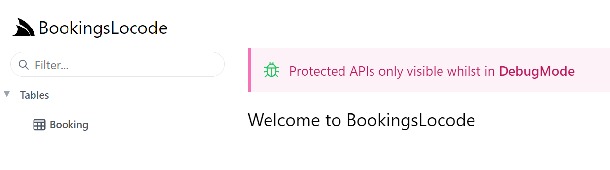

# Code-First Locode Development

Code-first AutoQuery services which drive Locode include both the database model and the related request and response Data Transform Objects (DTOs).
These two classes can have additional attributes and AppHost configuration to extend the Locode App visuals and behavior.

To get started quickly watch this video for a step-by-step walkthrough into creating a Code-first CRUD App with Locode:

<div class="py-8 max-w-7xl mx-auto px-4 sm:px-6">
  <div class="aspect-w-16 aspect-h-9">
    <iframe width="560" height="315" src="https://www.youtube.com/embed/mFyMgg7c3vg" title="YouTube video player"
            frameborder="0" allow="accelerometer; autoplay; clipboard-write; encrypted-media; gyroscope; picture-in-picture" allowfullscreen></iframe>
  </div>
</div>


## Bookings MVP

A simple example of using Locode for a back office bookings system would be a single table that a staff member populates.

### Create your project

To start off, we will create a project from the basic `web` template using the ServiceStack website. The link below will 
create a new project with the name "BookingsLocode".

<div class="flex">
<a href="https://account.servicestack.net/archive/NetCoreTemplates/web?Name=BookingsLocode" class="text-xl hover:no-underline">
    <div class="bg-white dark:bg-gray-800 px-4 py-4 mr-4 mb-4 rounded-lg shadow-lg text-center items-center justify-center hover:shadow-2xl dark:border-2 dark:border-pink-600 dark:hover:border-blue-600">
        <div class="text-center font-extrabold flex items-center justify-center mb-2">
            <div class="text-4xl text-blue-600 my-3">
                <svg xmlns="http://www.w3.org/2000/svg" class="w-12 h-12" viewBox="0 0 24 24">
                    <path fill="currentColor" d="M4 10.4V4a1 1 0 0 1 1-1h5V1h4v2h5a1 1 0 0 1 1 1v6.4l1.086.326a1 1 0 0 1 .682 1.2l-1.516 6.068A4.992 4.992 0 0 1 16 16a4.992 4.992 0 0 1-4 2a4.992 4.992 0 0 1-4-2a4.992 4.992 0 0 1-4.252 1.994l-1.516-6.068a1 1 0 0 1 .682-1.2L4 10.4zm2-.6L12 8l2.754.826l1.809.543L18 9.8V5H6v4.8zM4 20a5.978 5.978 0 0 0 4-1.528A5.978 5.978 0 0 0 12 20a5.978 5.978 0 0 0 4-1.528A5.978 5.978 0 0 0 20 20h2v2h-2a7.963 7.963 0 0 1-4-1.07A7.963 7.963 0 0 1 12 22a7.963 7.963 0 0 1-4-1.07A7.963 7.963 0 0 1 4 22H2v-2h2z"/>
                </svg>
            </div>
        </div>
        <span class="archive-name px-4 pb-2 text-blue-600 dark:text-indigo-400">BookingsLocode.zip</span>
        <div class="count mt-1 text-gray-400 text-sm"></div>
    </div>
</a>
</div>

The `web` template for a ServiceStack application will provide the basic solution structure
with a sample Hello World service. This can be done using the [ServiceStack website](https://servicestack.net) under
[Get Started](https://servicestack.net/start).

Alternatively, templates can be created using the dotnet CLI tool `x`. The dotnet `x` tool can be installed
using the following command:

:::sh
dotnet tool install --global x
:::

Once installed, a new `web` template can be created using:

:::sh
x new web MyProjectName
:::

### Mix in a database and AutoQuery

We can use the dotnet `x` tool to `mix` in specific database support and AutoQuery quickly using the command run from the project directory.

:::sh
x mix sqlite autoquery
:::

::: tip
Replace `sqlite` with `postgres`, `sqlserver`, or `mysql` or other RDBMS providers
:::

This command will create two files, `Configure.Db.cs` and `Configure.AutoQuery.cs` and install required NuGet dependencies into the AppHost (BookingsLocode in the link above) project.

### Bookings table

With our App now setup to use SQLite & AutoQuery, we'll define our `Booking` table where our data will be stored in:

```csharp
public class Booking
{
    [AutoIncrement]
    public int Id { get; set; }
    public string Name { get; set; }
    public RoomType RoomType { get; set; }
    public int RoomNumber { get; set; }
    public DateTime BookingStartDate { get; set; }
    public DateTime? BookingEndDate { get; set; }
    public decimal Cost { get; set; }
    public string Notes { get; set; }
    public bool? Cancelled { get; set; }
}

public enum RoomType
{
    Single,
    Double,
    Queen,
    Twin,
    Suite,
}
```

With our table schema defined in code, we can use OrmLite to create the table for us if it doesn't already exist,
which we do in the mix generated `Configure.Db.cs` where our SQLite connection is defined, using
`CreateTableIfNotExists()` to create the `Booking` table and populate it with Seed data when it's first created:

```csharp
public class ConfigureDb : IHostingStartup
{
    public void Configure(IWebHostBuilder builder) => builder
        .ConfigureServices((context, services) => {
            services.AddSingleton<IDbConnectionFactory>(new OrmLiteConnectionFactory(
                context.Configuration.GetConnectionString("DefaultConnection")
                ?? ":memory:",
                SqliteDialect.Provider));
        })
        // Create non-existing Table and add Seed Data Example
        .ConfigureAppHost(appHost => {
            using var db = appHost.Resolve<IDbConnectionFactory>().Open();
            if (db.CreateTableIfNotExists<Booking>())
            {
                // Seed data
                db.Insert(new Booking {
                    Name = "Test",
                    Cost = 123,
                    RoomNumber = 321,
                    RoomType = RoomType.Queen,
                    Notes = "Testing more",
                    BookingStartDate = new DateTime(2022, 1, 1),
                    BookingEndDate = new DateTime(2022, 1, 5)
                });
            }
        });
}
```

This configures our App's database ready for use, but we still don't have any AutoQuery APIs using them defined.

## AutoQuery APIs

To create an [AutoQuery API](https://docs.servicestack.net/autoquery-rdbms) to query our `Booking` RDBMS table, our 
Request DTO just needs to inherit `QueryDb<Table>` with `Booking` table they want the API to query:

```csharp
public class QueryBookings : QueryDb<Booking> {}
```

This empty Request DTO alone is all it takes to create an AutoQuery API that can query each `Booking` column using 
any of the [Implicit Conventions](https://docs.servicestack.net/autoquery-rdbms#implicit-conventions) registered in the
`AutoQueryFeature` plugin, e.g:

 - https://blazor-wasm-api.jamstacks.net/api/QueryBookings?Ids=1,2,3

However, to aid in the discovery of popular Booking table queries and make them easily accessible to all of ServiceStack's
[Typed Service Clients](https://docs.servicestack.net/add-servicestack-reference) or [gRPC Clients](https://docs.servicestack.net/grpc)
it's recommended to formalize queries you want to make available by adding typed properties to the Request DTO, e.g: 

```csharp
public class QueryBookings : QueryDb<Booking> 
{
    public int[] Ids { get; set; }
    //...
}
```

Where they can also be consumed by every Service Client with an end-to-end Typed API, e.g: 

```csharp
// C#
var client = new JsonApiClient("https://blazor-wasm-api.jamstacks.net");
var api = await client.ApiAsync(new QueryBookings { Ids = new[] { 1,2,3 }));
```

TypeScript Example:

```ts
// TypeScript
let client = new JsonServiceClient("https://blazor-wasm-api.jamstacks.net")
let api = await client.api(new QueryBookings({ Ids: [1,2,3] }))
```

### User-defined Routes

As AutoQuery APIs are themselves normal ServiceStack APIs they benefit from the entire customizability and ecosystem 
available to ServiceStack APIs, like [Routing](https://docs.servicestack.net/routing) where the API can be made available 
under custom user-defined using the `[Route]` attribute:

```csharp
[Route("/bookings")]
public class QueryBookings : QueryDb<Booking> 
{
    public int[] Ids { get; set; }
}
```

To also make the `QueryBookings` API available from the `/bookings` path, e.g:

- https://blazor-wasm-api.jamstacks.net/bookings?Ids=1,2,3

### AutoQuery CRUD APIs

To enable Auto CRUD behavior on your Table your Request DTOs can implement any of the following interfaces to create 
APIs with its respective CRUD behavior:

- `ICreateDb<Table>` - Insert a new Table row
- `IUpdateDb<Table>` - Fully Update an existing Table row
- `IPatchDb<Table>` - Partially update an existing Table row
- `IDeleteDb<Table>` - Delete an existing Table row

The Create and Update Request DTOs properties define which columns are updatable from the API: 

```csharp
public class CreateBooking
    : ICreateDb<Booking>, IReturn<IdResponse>
{
    public string Name { get; set; }
    public RoomType RoomType { get; set; }
    public int RoomNumber { get; set; }
    public DateTime BookingStartDate { get; set; }
    public DateTime? BookingEndDate { get; set; }
    public decimal Cost { get; set; }
    public string Notes { get; set; }
}

public class UpdateBooking
    : IPatchDb<Booking>, IReturn<IdResponse>
{
    public int Id { get; set; }
    public string Name { get; set; }
    public RoomType? RoomType { get; set; }
    public int? RoomNumber { get; set; }
    public DateTime? BookingStartDate { get; set; }
    public DateTime? BookingEndDate { get; set; }
    public decimal? Cost { get; set; }
    public bool? Cancelled { get; set; }
    public string Notes { get; set; }
}
```

Only a single Update DTO needs to be implemented to enable Update functionality in Locode. If `IPatchDb<Table>` is
implemented will use it to only update modified fields, whereas if only `IUpdateDb<Table>` is implemented, Locode needs
to send all fields to perform a full update.
If you have [AutoQuery CRUD Events](https://docs.servicestack.net/autoquery-audit-log) enabled it's recommended to use
`IPatchDb<Table>` for the audit logs to only capture which fields were updated.

To enable delete functionality in Locode create a Request DTO that implements `IDeleteDb<Table>` with the primary key
of the table:

```csharp
public class DeleteBooking : IDeleteDb<Booking>, IReturnVoid
{
    public int Id { get; set; }
}
```

Although not used by Locode, Delete APIs supports the same querying behavior as AutoQuery APIs where you could enable 
create an API that supports multiple and batch deletes with the fields you want to delete by, e.g:

```csharp
public class DeleteBookings : IDeleteDb<Booking>, IReturnVoid
{
    public int[]? Ids { get; set; }
    public bool? Cancelled { get; set; }
}
```

Locode is a capability-based UI that only enables functionality for CRUD APIs that exist and the currently authenticated 
user has access to. As these public APIs don't have any auth restrictions applied to them, they can be used immediately
by non-authenticated users without signing in to query, insert, update and delete from the `Booking` Table:



Clicking on our `Booking` services on the left-hand menu utilizes the `QueryBooking` AutoQuery API, we can see the test 
seed data that was populated.


Using the **New Booking** button gives us a metadata driven Form IO derived from the properties of the `CreateBooking` Request DTO:


This form also allows editing existing bookings using the Edit button in the first column given its functionality is enabled 
with the application having the `IPatch<Booking>` API defined.


## Customizing Locode App

We've walked through a simple example of how to create CRUD APIs for our `Booking` RDBMS table which Locode uses
to power its instant CRUD UI letting your App users start managing its data immediately. 

This touches on some basic functionality to get started in Locode, next we'll explore its declarative dev model
with the different ways you can annotate your services and data model to customize its behavior & appearance and
enhance it with additional functionality using the available composable built-in [declarative C# attributes](/locode/declarative).
